# The AI Organization

The organizational theory for the AI era. 
The root cause of AI failure is not technology — it is the organization itself. A structural analysis of leadership, culture, and performance evaluation systems.

  

 

## Prologue: The 70% Truth

In 2024, Boston Consulting Group published a finding on AI adoption that stopped many executives cold.

According to the study, technology itself — the algorithms and models — accounts for only **10%** of the value AI creates. Data infrastructure and system integration accounts for **20%**. The remaining **70%** comes from redesigning people and organizations.

The 10-20-70 rule.

The moment executives see these numbers, most feel a flash of cognitive dissonance. Because nearly every company today is pouring its investment into the 10% and the 20%. They deploy the latest LLMs, build data pipelines, run proof-of-concept after proof-of-concept, and report metrics like "92% AI adoption rate" and "10,000 monthly prompt executions" to their boards.

But they cannot answer the CFO's question.

**"So how much money did we actually make?"**

A McKinsey survey conducted in 2024 found that fewer than **20%** of companies are actually tracking KPIs for generative AI. IBM research shows that only **29%** of organizations can measure AI's return on investment.

Organizations are "adopting" AI. But they are not creating value with it.

The cause of this gap is not technology. It is the organization.

### Why Organizational Problems Stay Invisible

Technology adoption is easy to visualize. API contract counts, model versions, processing speed, response accuracy — everything becomes a number. You can put it on a dashboard. You can report it in the board meeting.

Organizational problems, by contrast, resist visibility.

"We hired an AI specialist, but our existing performance evaluation system couldn't recognize their value, and they left within a year" — this event is recorded in the HR database only as "voluntary resignation."

"We distributed Copilot licenses to every employee, but six months later only 3% were using it in their daily work" — this event appears in IT department reports as a "license utilization rate," but the reason 97% aren't using it is never recorded.

"The person we appointed to lead our AI transformation team was isolated by conflicts with existing business divisions, and every proposal they made was shelved" — this event is recorded nowhere at all.

BCG's 70% stays invisible because organizational failures get shrunk into someone's personal problem. Technology failures get shared company-wide as system outages. Organizational failures get processed as individual performance issues.

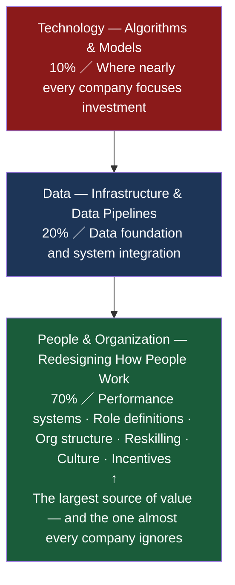

### The Spread of "Metrics Theater"

In 2024, Salesforce's engineering division launched an internal evaluation overhaul called "Engineering 360." 
The trigger: after deploying AI coding tools company-wide, developers began using AI to generate vast amounts of code, and the traditional productivity metric — lines of code — had lost all meaning. The sheer *volume* of code exploded, but its correlation with quality and business impact completely collapsed.

This is not one company's story. It is the defining example of "metrics theater" spreading through AI-adopting organizations — a condition in which everything looks like success on paper, but nothing has actually changed.

| What Gets Reported | What Should Actually Be Asked |
|:---|:---|
| AI adoption rate: 92% | Did our business processes change? |
| Monthly prompt executions: 10,000 | Did the quality of our decisions improve? |
| Copilot licenses distributed company-wide | What percentage of employees actually use it daily? |
| AI-related patent filings: +40% | How many of those patents generated revenue? |
| Internal AI hackathon participants: 500 | How many hackathon ideas were actually applied to real work? |

Numbers do not lie. But numbers can hide the truth, depending on what you choose to measure.

### The Structure of This Book

This book dissects the structural questions AI is forcing organizations to confront — across nine chapters.

* **Chapter 1** analyzes a controlled experiment: DeNA and Klarna both declared themselves "AI-first" at roughly the same time, and arrived at diametrically opposite outcomes. We examine the structural difference between a model that reinvests AI-liberated human resources into new business creation, and one that uses AI purely for cost optimization.

* **Chapter 2** follows the organizational flattening underway at technology giants — Amazon, Google, Microsoft, and NVIDIA. Gartner's prediction that AI will absorb more than 50% of middle management positions is not a story about headcount reduction. It is a story about the transformation of decision-making structures.

* **Chapter 3** is the heart of this book. It dissects "metrics theater" — the structural collapse of performance evaluation systems that cannot measure AI's contribution. Companies whose evaluation systems are misaligned with the value creation logic of the AI era will lose their highest-value people first.

* **Chapter 4** cuts into the structural pathologies unique to Japanese organizations: the "Diligence Paradox" that Tomoko Namba diagnosed, the institutional logic that forced LINE Yahoo to mandate AI usage, and the three-way contradiction between seniority-based pay, skill-grade systems, and AI talent evaluation.

* **Chapter 5** confronts the illusion and reality of reskilling. SoftBank's case — in which every employee built 100 AI agents each in two and a half months — and the far more common reality of "train and forget."

* **Chapter 6** draws a critical distinction between the new roles of the AI era: the "Power User" and the "Frontier Professional." Those who increase the volume of AI output and those who redesign the business processes themselves are fundamentally different kinds of people.

* **Chapter 7** defines the role of the "Orchestrator" — the person who stands between AI and human beings.

* **Chapter 8** presents the design principles of an AI-first organization, from both theory and practice.

* **The Epilogue** confronts the question Tomoko Namba posed: "When the time comes that AI is the one assigning work to humans, where does human dignity reside?"

### Why I Wrote This Book

My career has taken me across three domains: business, technology, and creative. 
IT consulting (including two full-scale core system replacements), business development, design thinking. 
From the intersection of all three, something became clear.

**When AI adoption fails, technology is never the reason.**

Failure happens when senior leadership treats AI as a technology initiative and never frames it as an organizational design problem. 
It happens when organizations cannot evaluate AI talent fairly. 
It happens when performance evaluation systems are fundamentally misaligned with how value gets created in the AI era. 
It happens when management goes seven months without giving a single piece of feedback — and then, the moment the person proposes stepping back, says: "Actually, we wanted you to do more."

This book is **not a critique of any specific organization. It is a structural autopsy.**

**BCG has told us what the 70% is worth. The purpose of this book is to reveal what it actually contains — through concrete cases and structural analysis.**

### References

1. BCG "Maximizing Return on AI Investments" — The 10-20-70 rule for value creation in AI
   https://www.bcg.com/publications/2024/maximizing-return-on-ai-investments

2. McKinsey "The State of AI in Early 2024" — Fewer than 20% of companies track generative AI KPIs
   https://www.mckinsey.com/capabilities/quantumblack/our-insights/the-state-of-ai

3. IBM "Global AI Adoption Index 2024" — Only 29% of organizations can measure AI ROI
   https://www.ibm.com/thought-leadership/institute-business-value/en-us/report/ai-adoption

4. Salesforce "Engineering 360" — Evaluation reform after AI coding tool deployment
   https://www.salesforce.com/news/stories/ai-engineering-productivity/

 

## Chapter 1: Light and Shadow — The DeNA–Klarna Controlled Experiment

In 2024, two companies declared themselves "AI-first" at almost exactly the same moment.

One was DeNA, a Japanese internet company. The other was Klarna, a Swedish fintech firm.

Both placed AI at the center of their corporate strategy and committed to restructuring their organizations from the ground up. 
The language they used was nearly identical: "AI-first," "every employee uses AI," "dramatic improvement in operational efficiency."

One year later, the outcomes were exact opposites.

### DeNA: The Audacity of "Ten People, One Unicorn"

DeNA's Chairman, Tomoko Namba, said this at the company's 2024 earnings presentation:

**"The time freed up by AI should not be reinvested in making existing work more efficient. It should be reinvested in building new businesses."**

At first glance, this sounds obvious. But what Namba was pointing to was the structural trap that most Japanese companies fall into.

AI reduces working hours by 30%. So what does the conscientious Japanese employee do? 
They fill that 30% with more existing work. Overtime decreases. Cost per unit of output drops. 
The CFO is satisfied. But **nothing new has been created.**

Namba called this the **"Diligence Paradox."**

DeNA chose a different road. 
The human capacity liberated by AI would be deliberately redirected into creating new businesses. 
The company rallied around the slogan **"Ten People, One Unicorn":** 
if you use AI as leverage, business development that once required 100 people can be run by 10. 
And those 10 people can build something worth a billion dollars.

Simultaneously, DeNA introduced a proprietary metric: **DARS (DeNA AI Readiness Score)**. 
This system quantitatively measures every employee's depth of AI utilization and visualizes AI maturity by department. 
Its design philosophy is not "did we deploy it?" but "are we genuinely using it?" — a direct counterargument to the metrics theater described in the prologue.

Furthermore, Namba herself demonstrated AI tools in front of the entire company. 
The Chairman writing prompts, evaluating AI outputs, iterating. 
By showing everyone what it looks like to actually use AI, she drove behavioral change across the organization.

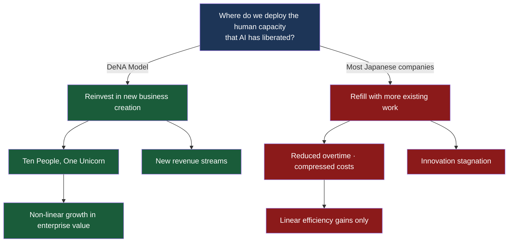

### Klarna: The CEO Who Admitted "We Went Too Far"

That same year, Klarna executed the most aggressive AI-driven organizational transformation in the world.

CEO Sebastian Siemiatkowski used AI to cut the workforce from **5,527 to 2,907 people** — nearly half. 
The company froze all hiring and compressed headcount through attrition and AI substitution.

The results were dazzling on paper:

- Revenue: **up 108%**
- Revenue per employee: **dramatically improved**
- Average salary: **up 60%** (redistributed to remaining staff)
- Customer service: AI chatbots **replaced the work of 700 people**
- Marketing: external agency spending **significantly reduced**

Wall Street cheered. Klarna's valuation surged and the path to IPO cleared. 
Siemiatkowski was invited to conferences around the world as the standard-bearer of the AI-native company.

Then, in early 2025, he made a surprising confession.

**"We went too far."**

What had happened?

Customer satisfaction had fallen. 
The AI chatbots handled routine inquiries just fine — but they could not cope with complex problems or emotionally charged complaints. 
In situations that called for a human operator to intervene, AI kept responding, and the customer experience degraded.

Klarna reopened hiring and began bringing human customer service agents back.

### The Structural Difference Between the Two Models

The difference between DeNA and Klarna is not about AI capability. It is about **the philosophy of organizational design.**

| | DeNA | Klarna |
|:---|:---|:---|
| **Role of AI** | Leverage to liberate human capacity | Tool to replace human capacity |
| **Where liberated resources go** | Into new business creation | Into cost reduction and margin improvement |
| **Impact on people** | Redeployment · reinvestment in new ventures | Massive reduction (5,527 → 2,907) |
| **Evaluation system** | DARS (quantified AI utilization) introduced | Existing revenue metrics unchanged |
| **Leadership behavior** | Namba personally demonstrates AI tools to all staff | CEO communicates reduction results externally |
| **One year later** | New business pipeline under construction | Customer satisfaction decline → hiring restart |

Klarna's failure was not caused by inadequate AI performance. 
It was caused by a failure to design **the mechanisms by which humans complement AI.**

AI replaced the work of 700 people. But it did not replace the judgment, empathy, and exception-handling capability those 700 people carried. 
When those capabilities were needed, AI either went silent or returned a response that missed the point entirely.

### Shopify: A Third Way

One more perspective deserves a place in this experiment.

In early 2025, Canadian e-commerce platform Shopify announced a company-wide policy:

**"If you want to request a new hire, you must first prove that the task cannot be performed by AI."**

This was the substance of the memo CEO Tobi Lütke sent to all employees.

This is fundamentally different from Klarna's "replace people with AI" approach. 
What Shopify is demanding is that **every position's value be redefined in comparison to AI.**

The question is not "should this work be done by a human or by AI?" 
The question is: "when a human does this work, what value gets created that AI cannot create?"

This question is directed at every position in the organization — managers, engineers, designers, salespeople. 
And any position that cannot explain why it cannot be replaced by AI does not need to exist in the first place.

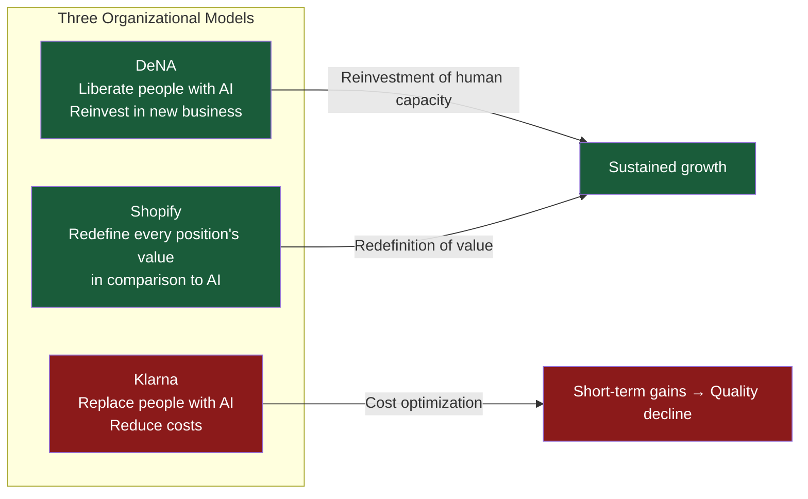

### The Lesson of This Chapter

Declaring yourself AI-first has no inherent value. 
What matters is the design: **what AI will liberate, what it will replace, and what it will redefine** within your organization.

DeNA chose liberation. Klarna chose replacement. Shopify chose redefinition.

These three approaches are not mutually exclusive. 
But the philosophy an organization chooses first shapes every decision that follows. 
Organizations that begin with "cost reduction" will keep treating AI as a substitute variable for labor costs. 
Organizations that begin with "value creation" will keep treating AI as leverage for new opportunity.

This book's central question is: **which one has your organization chosen?**

### References

1. DeNA Tomoko Namba, "All-In on AI Declaration" — 2024 Earnings Presentation
   https://dena.com/jp/ir/

2. DeNA DARS (DeNA AI Readiness Score) — Company-wide AI utilization evaluation
   https://dena.com/jp/article/004252/

3. Klarna CEO Sebastian Siemiatkowski, "We went too far" — Bloomberg interview, 2025
   https://www.bloomberg.com/news/articles/2025-02-20/klarna-ceo-says-utilitarian-utilitarian-utilitarian-ai-approach-went-too-far

4. Klarna AI Assistant — 700 human roles replaced
   https://www.klarna.com/international/press/klarna-ai-assistant-handles-two-thirds-of-customer-service-chats-in-its-first-month/

5. Shopify CEO Tobi Lütke — Company-wide memo, "Prove AI cannot do it"
   https://twitter.com/toaborern/status/1907090292748984538

6. BCG "AI at Work: Friend and Foe" — Humans as the source of differentiation
   https://www.bcg.com/publications/2024/ai-at-work-friend-and-foe

 

## Chapter 2: The End of the Org Chart

From 2024 into 2025, a consistent pattern emerged across the world's technology companies.

* Amazon eliminated **more than 30,000 positions.** Google merged DeepMind and Google Brain into a single unified AI research division.
* Microsoft integrated its consumer Copilot team and enterprise Copilot team, centralizing its AI agent strategy under one roof.
* NVIDIA CEO Jensen Huang publicly stated that 60 people report directly to him — a deliberate rejection of traditional hierarchical management.

These are not isolated HR decisions. They are **tectonic shifts in organizational structure itself.**

### 50% of Middle Management Is Disappearing

In a 2024 prediction report, Gartner presented a number that landed like a grenade:

**"By 2026, more than 50% of middle management positions at large enterprises will be eliminated by AI or fundamentally redefined."**

When you break down what middle managers actually do, most of it maps directly onto AI's areas of strength:

| Core Middle Manager Responsibilities | AI Substitutability |
|:---|:---|
| Aggregating information and reporting upward | **High** — dashboards, automated report generation |
| Monitoring team task progress | **High** — project management tools, AI assistants |
| Routine decision-making | **High** — rule-based systems + LLM-assisted judgment |
| Cross-departmental communication and coordination | **Medium–High** — AI agents for automated handoffs |
| Developing and mentoring subordinates | **Low** — human involvement is essential |
| Navigating exceptional and political decisions | **Low** — requires contextual understanding and organizational dynamics |

The top four are already substitutable at a practical level. The bottom two, for now, require humans.

The problem is that most middle managers spend the majority of their time on the top four. 
Collecting information, organizing it, reporting upward. Checking on task completion, following up on delays. Coordinating with adjacent departments. 
When AI absorbs those activities, what remains for middle managers is "development" and "exception judgment."

Can those two functions alone justify the position?

### NVIDIA: The Experiment in the "Organization Without Organization"

Jensen Huang is one of the most radical organizational thinkers in Silicon Valley.

**Sixty people report directly to him.** 
The standard management textbook recommends a CEO's span of control at 7±2 direct reports. Huang's is ten times that.

His logic is uncompromising: 
The deeper the hierarchy, the more information degrades in transit. 
By the time field-level information reaches the CEO through three layers, it has been filtered three times, reformatted three times into "something appropriate to report." 
What the CEO sees is not reality. It is a summary of a summary of a summary of reality.

In an era when AI can aggregate and visualize information across the entire company in real time — why do we need middle managers as information relay stations?

NVIDIA's organization is designed on the premise of **"information democracy."** 
Nearly every employee has access to the same information. The CEO converses directly with engineers on the front line. 
The result: decision-making speed increases dramatically.

That said, this works because NVIDIA is laser-focused on a **single, highly specialized business** — chip design. 
A diversified conglomerate attempting the same model would quickly overwhelm the CEO's cognitive capacity. 
Huang's organizational theory is not a universal prescription — it is the limit case of what becomes possible when AI takes over information transmission.

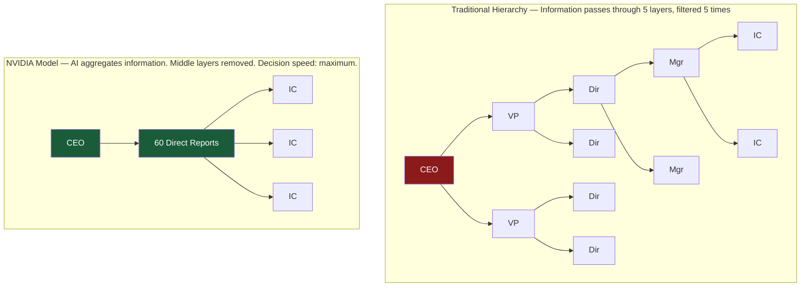

### JPMorgan: AI Reporting Directly to the CEO

JPMorgan Chase, the world's largest bank, separated its AI division from IT in 2024 and placed it **directly under the CEO.**

The structural rationale is clear.

Most companies house their AI initiatives under IT. "AI is technology," the reasoning goes. 
But IT's core mission is system stability and security. Its culture is built on "do not break things." 
Pushing AI transformation — whose essence is "break things and rebuild them" — into that culture is like pressing the brake and accelerator simultaneously.

JPMorgan CEO Jamie Dimon framed AI not as a technology evolution but as a strategic business pivot. 
That is why it lives under the CEO — not the CIO.

The bank is investing **more than $3 billion annually** in AI-related initiatives, has laid out a reskilling plan covering all **300,000 employees**, and has more than 2,000 AI use cases operating across business divisions.

What this organizational design declares is that **AI is not a functional department problem — it is a leadership problem.**

### Microsoft: The Silos That Killed the Synergy

In the second half of 2024, Microsoft merged its consumer Copilot team and its enterprise Copilot team.

Before the merger, the two teams operated independently. 
The consumer team was building Bing Chat (later Copilot). The enterprise team was building Microsoft 365 Copilot. 
The underlying technology — essentially the same OpenAI models — was shared. The organizations were not.

The problem: **in the age of AI agents, siloed organizations become lethal.**

A user creates a document in Copilot, co-edits it on Teams, connects it to customer data in Dynamics. 
For that seamless experience to exist, there can be no boundary between consumer and enterprise. 
When separate teams are building to separate roadmaps, the user experience fractures.

Microsoft's lesson: **AI-era organizations should be designed around experiences, not products.**

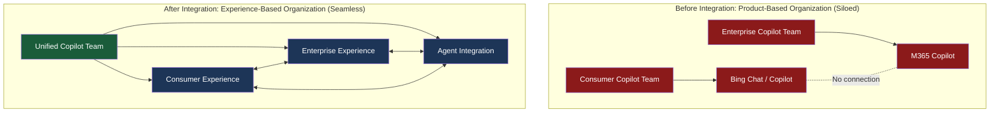

### Google DeepMind: Merging Research and Business

In 2023, Google merged DeepMind with Google Brain — its internal AI research team — into a single entity: **Google DeepMind.**

Before the merger, the two organizations were effectively rivals within the same company. 
They pursued the same research territory with different teams and different approaches. 
Political tensions over co-authorship of academic papers. Competition over compute resources. 

In an earlier era, this redundancy and internal rivalry would have been tolerated — even celebrated as "internal competition drives innovation." 
But after GPT-4, the speed of AI development accelerated to the point where falling months behind means a fatal loss in the market. 
There was no longer any margin to waste energy on internal politics.

What Google DeepMind's merger demonstrated: **AI-era organizations cannot afford redundancy.** 
Having two organizations pursuing the same purpose is itself a source of decision-making delay.

### The True Nature of Flattening: A Question of Speed

The pattern across these cases is clear.

The organizational reforms at NVIDIA, JPMorgan, Microsoft, and Google are not about efficiency. They are about **decision-making speed.**

Pre-AI organizations stacked layers of hierarchy in the name of accuracy. 
Field-level information was filtered by middle management, escalated upward, approved, and returned to the field. 
If the round trip took three days, it was justified as "careful decision-making."

In AI-era competitive environments, three days is fatal.

A competitor is using AI agents to detect market shifts in real time, adjusting strategy in hours, and shipping new products the next day. 
No organization running three-layer approval processes can keep up with that speed.

Organizational flattening is not a story about headcount reduction. 
It is **a structural reform that brings the speed of information flow and decision-making into alignment with the competitive tempo of the AI era.**

### Positions That Disappear, Positions That Emerge

Gartner's "50% of middle management disappears" prediction does not mean all middle managers become unnecessary. 
It means that **middle managers whose core job is information relay and task tracking** become unnecessary.

At the same time, new positions become essential:

| Disappearing Positions | Emerging Positions |
|:---|:---|
| Managers whose primary role is aggregating and reporting information | Strategists who design AI utilization strategy |
| Managers whose primary role is assigning tasks and tracking progress | Orchestrators who design human-AI collaboration |
| Managers whose primary role is cross-departmental coordination | Leaders who make exception judgments and shape organizational culture |
| Managers who manage routine approval processes | Auditors who critically evaluate AI outputs |

The org chart changes. But the organization does not disappear. The organization's **functions** get redefined.

The problem is that the evaluation systems, incentive structures, and career path designs needed to execute this redefinition remain untouched at most companies.

The next chapter cuts into the core of this neglected 70% — the structural collapse of performance evaluation.

### References

1. Gartner "Predicts 2025: AI and the Evolution of the Workforce" — Prediction that 50%+ of middle management positions will be eliminated
   https://www.gartner.com/en/articles/ai-workforce-predictions-2025

2. NVIDIA Jensen Huang — The design philosophy behind 60 direct reports and a flat organization
   https://hbr.org/2024/06/nvidias-jensen-huang-on-leading-the-ai-revolution

3. JPMorgan Chase — AI under direct CEO authority · $3B annual investment · 300,000-person reskilling plan
   https://www.jpmorgan.com/technology/artificial-intelligence

4. Microsoft Copilot organizational integration — Eliminating the consumer/enterprise silo
   https://blogs.microsoft.com/blog/2024/11/copilot-organization-update/

5. Google DeepMind integration — Unifying Brain + DeepMind
   https://blog.google/technology/ai/april-ai-update/

6. Amazon 30,000+ layoffs — 2024 organizational restructuring
   https://www.aboutamazon.com/news/company-news/amazon-layoffs-2024

 

## Chapter 3: Metrics Theater — The Structural Collapse of Performance Evaluation

This chapter is the heart of the book.

Of all the reasons AI adoption fails, this one runs the deepest, stays the most invisible, and drives the most talent out of organizations: 
**the structural collapse of performance evaluation.**

### The Broken Yardstick

Imagine a software company.

The company deployed AI coding assistants company-wide in 2024. 
Developer productivity visibly improved. 
What used to take three days took one. Code review feedback decreased. Bug rates fell.

But at the end-of-quarter performance review, something strange happened.

Engineer A — who was using AI most effectively — had delegated initial code generation to AI and was spending their own time on architecture design and quality assurance. 
Their **lines of code had dropped 40%** from the previous quarter.

Engineer B — who was barely using AI — continued writing code by hand. Their line count was flat.

Under the old evaluation system, Engineer B is assessed as "more productive." Engineer A is recorded as having "reduced output."

**Engineer A updated their resume at the end of the quarter.**

This is metrics theater. 
What the evaluation system measures and what is actually generating value have decoupled. 
And the first person to notice the gap is always the most talented person in the room.

### Salesforce "Engineering 360" — Reinventing Evaluation

Salesforce is one of the rare companies that confronted this problem head-on.

In 2024, its engineering division launched an evaluation overhaul called "Engineering 360." 
The catalyst: after deploying AI coding tools company-wide, traditional productivity metrics — lines of code, commits, pull requests — had lost their meaning.

Engineering 360 is built on three principles:

**Principle 1: Measure outcomes, not inputs.**
Evaluate not how many lines of code were written, but what business impact that code delivered: 
feature release velocity, contribution to customer satisfaction, contribution to system stability.

**Principle 2: Build "how you used AI" into the evaluation.**
Give genuine credit to the act of using AI effectively to improve architectural quality. 
Treat the act of rigorously reviewing and improving AI-generated code as equal to — or better than — writing code from scratch.

**Principle 3: Measure from multiple directions with 360-degree feedback.**
Integrate feedback not only from managers, but from peers, reports, and other departments. 
AI utilization is often invisible from a manager's vantage point alone.

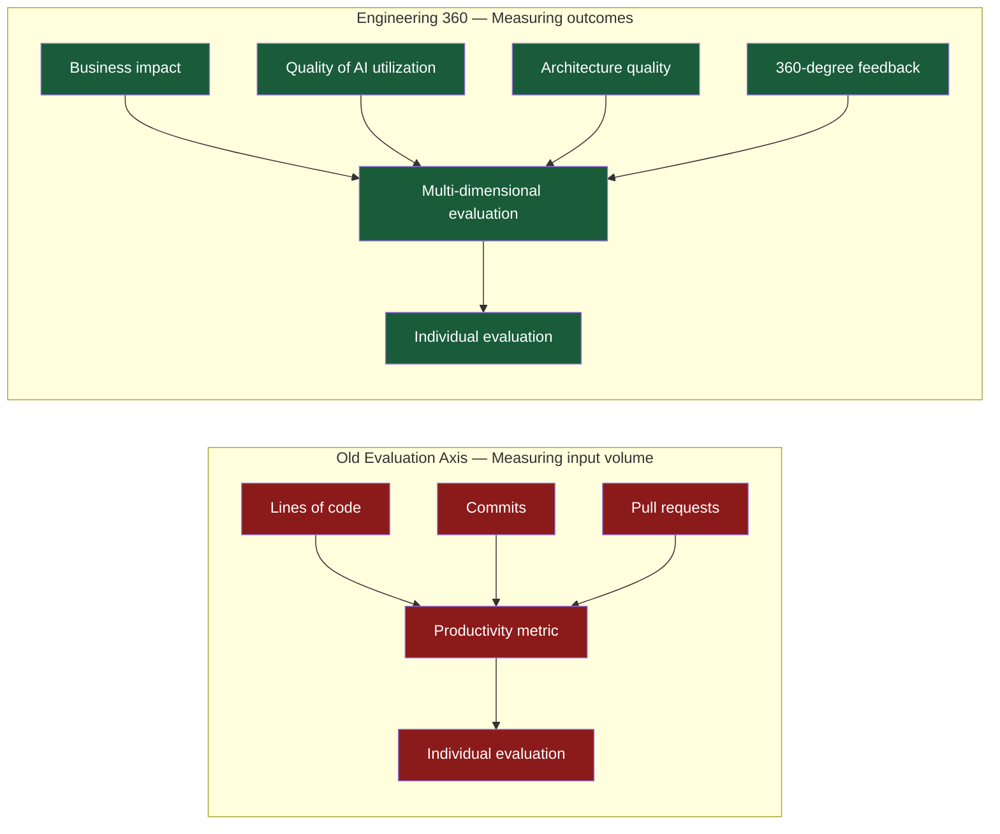

### DeNA "DARS" — Quantifying AI Maturity

We introduced DeNA's DARS briefly in Chapter 1. Let's analyze it in detail here.

DARS quantifies every employee's depth of AI utilization across five levels. 
It doesn't merely track whether someone is using AI — it measures how deeply they're using it.

| Level | Definition | Estimated Internal Distribution |
|:---|:---|:---|
| Level 1 | Aware of AI tools but not using them | ~15% |
| Level 2 | Using AI in a supplementary, routine way | ~35% |
| Level 3 | AI is integrated into the core of their work processes | ~30% |
| Level 4 | Using AI to design new work processes | ~15% |
| Level 5 | Using AI to create new businesses or services | ~5% |

DARS's breakthrough design choice: **it explicitly defines Level 3 and above as "genuine AI utilization" and classifies Levels 1–2 as "surface-level usage."**

Most companies report their "AI adoption rate" in numbers that include Levels 1 and 2. 
"80% of our employees are using AI tools" is easy to achieve if you count Level 1 (touched it once). 
But the only levels generating business value are Level 3 and above.

DARS scores are visualized by department and reported in management meetings. 
Departments stuck at Level 2 or below are not sent to AI literacy training. They are required to **redesign their work processes themselves.**

### CyberAgent: The Creative Evaluation Revolution

CyberAgent executed the most explicit post-AI evaluation reform of any company — specifically for creative roles.

After AI began generating large volumes of initial concepts for image and copy in the company's advertising creative division, the role of the human creator fundamentally transformed.

**Before AI:** 
Creators developed concepts from a blank page, produced visuals, and wrote copy. 
The standard for evaluation was "the ability to create."

**After AI:** 
AI generates 100 concepts in three minutes. 
The creator's job became selecting the most effective from those 100, refining them, combining them, and guaranteeing final quality — in short, "**direction**."

CyberAgent revised its evaluation framework to match this change. 
The new standard is not "number of pieces produced" but "quality of direction." 
Specifically: how did they improve the AI's output? And how did the final deliverable contribute to advertising performance (click rates, conversion rates)?

This case matters because it is one of the first instances of explicitly embedding into an evaluation system the principle that **after AI takes over "execution," what remains for humans is "judgment" and "direction."**

### PwC: The Wage Premium for AI Skills

A global study PwC published in 2024 surfaced another structural fact:

**Workers with AI skills earn an average wage premium of 25% over those without.**

And the gap is widening. 
The premium was 18% in 2023. By 2024 it had grown to 25%.

What this means: the gap between the **market value** and the **internal evaluation** of AI talent is widening every year.

Consider an AI-capable employee who is graded internally as a "senior-level general staff" position. 
Annual salary: ¥8 million. But the external market is offering ¥10 million or more for the same skill set.

The AI talent who recognizes that 25% gap will eventually — sooner rather than later — begin exploring options. 
And the more talented the AI person, the larger the gap between their market value and their internal evaluation tends to be.

**Companies whose evaluation systems are misaligned with market value will lose their highest-value people first.**

This is not theory. It is structural inevitability.

```mermaid
graph TD
    subgraph GAP["Market Value vs. Internal Evaluation of AI Talent (PwC 2024)"]
        M["Market value: ¥10M+"]
        G["25% gap"]
        S["Internal evaluation: ¥8M"]
        M --> G --> S
    end

    subgraph ACT["The behavioral scenario of AI talent who recognizes the gap"]
        A1["① Confirms external evaluation (LinkedIn · executive search)"]
        A2["② Attempts to improve internal evaluation"]
        A3["③ Decides to leave if nothing changes"]
        A4["The more talented the person, the faster they reach step ③"]
        A1 --> A2 --> A3 --> A4
    end

    style M fill:#1a5c3a,color:#fff
    style G fill:#1d3557,color:#fff
    style S fill:#8b1a1a,color:#fff
    style A1 fill:#1d3557,color:#fff
    style A2 fill:#1d3557,color:#fff
    style A3 fill:#8b1a1a,color:#fff
    style A4 fill:#8b1a1a,color:#fff
```

### Section Research: Only 3% Are "Practitioners" or Above

The most unflinching portrait of AI utilization reality came from a Section survey of knowledge workers conducted in 2024.

The survey classified knowledge workers' AI utilization into four levels:

| Level | Definition | Proportion |
|:---|:---|:---|
| Non-user | Not using AI in their work | ~45% |
| Dabbler | Using AI occasionally, without a systematic approach | ~37% |
| Practitioner | AI is integrated into their daily work | ~15% |
| Advanced | Using AI to redesign their work processes | **~3%** |

**85% of knowledge workers have not yet established AI use cases that generate value. Practitioners or above account for just 3%.**

This number reveals how disconnected "AI adoption rate: 92%" is from actual reality. 
If you have a license and a login record, you're "adopted." But the only people generating business value are the 3%.

And the problem is that this Advanced 3% is, at most organizations, not being fairly evaluated under existing performance systems. 
They are doing work — "redesigning work processes using AI" — that does not exist in traditional job descriptions. 
There is no corresponding line item on the evaluation rubric. Often, the manager doesn't have the literacy to understand the value being created.

### The Mechanism by Which Evaluation Systems Kill Organizations

Integrating the analysis so far, we can see that the damage from a structurally broken evaluation system progresses in three stages:

**Stage 1: Recognition of the Gap** 
AI-capable talent notices the divergence between their internal evaluation and their market value. 
LinkedIn recruiter messages. Casual interviews. Job postings at competitor companies. 
External information makes the distortions in the internal evaluation system visible.

**Stage 2: Silent Disengagement** 
Rather than speaking up, the dissatisfied talent quietly begins preparing to leave. 
They strengthen their external presence, build their portfolio, expand their network. 
Physically still inside the organization. Psychologically already outside it.

**Stage 3: The Most Valuable AI Talent Exits** 
The people most needed in the AI era are the first to walk out the door.

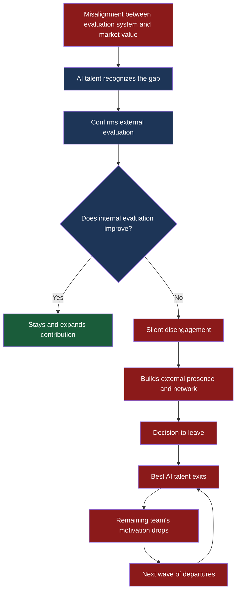

This three-stage process is almost entirely invisible from the outside. 
Right up to the moment the resignation letter arrives, the organization believes it is "running smoothly."

But if you look carefully at the engagement survey, the signs are there: 
trust in one's manager, satisfaction with growth opportunities, perceived fairness of evaluation. 
When the lowest scores cluster around those items, it is not one person's frustration. It is the early signal of structural collapse.

### The Prescription: What Should We Measure?

Redesigning evaluation systems means more than "adding AI skills as an evaluation criterion." 
What's needed is **a fundamental shift in what you choose to measure.**

| Old Evaluation Axis | AI-Era Evaluation Axis |
|:---|:---|
| Volume of output (lines of code, number of proposals) | Quality of outcomes (business impact, customer value) |
| Individual hours worked | Results achieved through human-AI collaboration |
| Degree of compliance with defined job responsibilities | Contribution to expanding and redesigning job definitions |
| One-directional evaluation by manager | 360-degree feedback + AI metrics |
| Annual evaluation | Real-time feedback |

Executing this shift requires simultaneously rewriting not just evaluation systems, but job definitions, compensation structures, and career paths.

The next chapter enters the environment where this rewriting is hardest of all — the structural pathologies of Japanese organizations.

### References

1. Salesforce "Engineering 360" — Evaluation reform after AI coding tool deployment
   https://www.salesforce.com/news/stories/ai-engineering-productivity/

2. DeNA DARS — Five-level quantified AI utilization evaluation
   https://dena.com/jp/article/004252/

3. CyberAgent — Evaluation reform for creative roles after AI adoption
   https://www.cyberagent.co.jp/techinfo/ai/

4. PwC "Global AI Jobs Barometer 2024" — 25% wage premium for AI skill holders
   https://www.pwc.com/gx/en/issues/artificial-intelligence/job-barometer.html

5. Section "State of AI at Work 2024" — 85% of knowledge workers lack established AI use cases; Advanced tier just 3%
   https://www.section.com/state-of-ai-at-work

6. McKinsey "The State of AI in Early 2024" — Fewer than 20% of companies track generative AI KPIs
   https://www.mckinsey.com/capabilities/quantumblack/our-insights/the-state-of-ai

7. IBM "Global AI Adoption Index 2024" — Only 29% of organizations can measure AI ROI
   https://www.ibm.com/thought-leadership/institute-business-value/en-us/report/ai-adoption

 

## Chapter 4: The Structural Pathologies of the Japanese Organization

The structural collapse of performance evaluation systems analyzed in Chapter 3 is a problem shared by companies everywhere. 
But Japanese organizations carry **additional structural pathologies** that make this problem considerably worse.

### Tomoko Namba's "Diligence Paradox"

DeNA Chairman Tomoko Namba spoke candidly about Japan's distinctive AI challenge at a 2024 conference.

AI improves operational efficiency by 30%. The Japanese employee looks at that freed-up 30% and asks: what do I do with it? 
Not: what new challenges can I take on? 
Instead: **I'll fill it with 30% more of the same existing work.** 
Overtime decreases. Cost per unit of output drops. But no innovation emerges.

Namba called this the "Diligence Paradox."

Japanese organizational culture places enormous value on reliably executing the work you've been given. 
"I have some free time, so I'll start something new" is not typically rewarded at most Japanese companies. 
In fact, it often reads as "doing something irrelevant."

This "diligence" was a virtue in the pre-AI era. 
Processing routine work accurately, maintaining quality, hitting deadlines. 
The strength of Japanese manufacturing was built on this quality of diligence.

But in the AI era, this very "diligence" becomes **a structural shackle.**

After AI takes over routine work, what's needed is the ability to define from scratch what should be done. 
Not the ability to execute assigned tasks with high precision — but the ability to create the tasks themselves. 
Japanese organizational culture and evaluation systems were not designed to develop that ability.

### LINE Yahoo: The Logic Behind the Mandate

In 2024, LINE Yahoo mandated AI usage for all employees.

"Mandate" sounds anachronistic at first. Shouldn't we be cultivating a culture where people voluntarily embrace AI?

But there is a structural logic behind LINE Yahoo's choice.

At most Japanese companies, AI is seen as "something skilled people do" or "IT's responsibility." 
Even when senior leadership promotes AI use, if frontline managers decide "we're too busy with existing work," the message stops there. 
There is a thick buffer between company-wide policy and actual frontline behavior.

To break through that buffer, "encouragement" is not enough. **It has to be a mandate.**

LINE Yahoo's implementation: all employees are required to use internal AI tools a minimum number of times per month, and managers review usage logs. 
Employees who aren't using them receive individualized follow-up.

This is not "control." It is **a strategy for simultaneously raising the behavioral threshold of the entire organization.**

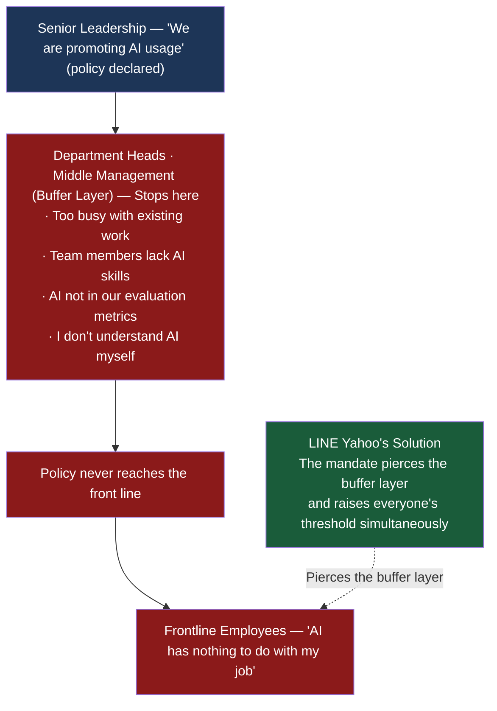

### PwC Five-Country Comparison: Japan's "Average at Adoption, Last at Outcomes"

A five-country comparative study published by PwC Japan in 2024 put Japan's problem into numbers.

Among the five countries surveyed — Japan, the United States, the United Kingdom, Germany, and Australia — Japan's **AI adoption** ranked in the middle: average on project count, investment, and PoC implementation rate.

But **outcomes** — the degree to which companies are actually extracting business results from AI — placed Japan **dead last** among the five.

| Country | AI Adoption (Relative Rank) | Outcomes (Relative Rank) |
|:---|:---|:---|
| United States | 1st | 1st |
| United Kingdom | 2nd | 2nd |
| Germany | 3rd | 3rd |
| Australia | 4th | 4th |
| **Japan** | **3rd** | **5th** |

Japan is adopting AI. Japan is not generating results from AI.

PwC's analysis identifies three root causes of this gap:

**1. Absence of top-down leadership.** 
In the US, CEOs frequently drive AI strategy directly. In Japan, the role is typically delegated to the CIO or CTO, and integration with business strategy remains incomplete.

**2. Cross-organizational walls.** 
Japan's divisional structure blocks information sharing and resource allocation across departments. AI adoption becomes siloed by division and never scales company-wide.

**3. Low talent mobility.** 
AI talent stagnates inside organizations without being properly recognized, but can't be replaced with external hires either. Seniority-based pay doesn't align with market compensation for external AI talent, and reskilling existing employees takes time.

### The Triple Contradiction: Seniority × Skill Grades × AI Talent

The "skill grade system" used at most Japanese companies contains a fundamental contradiction in the AI era.

The skill grade system classifies employees' "capabilities" into grades and pays salaries according to grade. 
These "capabilities" are assumed to grow with tenure and experience. 
A ten-year employee is presumed, by the system, to be more capable than a five-year employee.

But AI capability does not correlate with tenure.

It is not uncommon for a second-year employee to use AI at a far more sophisticated level than a ten-year manager. 
Digital natives have a structurally higher rate of adaptation to AI tools.

When that's the case, how does the skill grade system function?

The second-year AI expert is placed at Grade 3 (lower tier of 10). The ten-year manager is at Grade 7. Salaries track grade. 
AI utilization is not included as an evaluation criterion.

**Result: the person generating the most value for the organization receives the lowest compensation.**

| | 2nd-Year AI Expert | 10th-Year Manager |
|:---|:---|:---|
| AI utilization level | Level 5 (Advanced) | Level 2 (Dabbler) |
| Business contribution | Redesigned 3 work processes using AI | Managing existing operations |
| Skill grade | Grade 3 | Grade 7 |
| Annual salary | ¥4.5M | ¥8M |
| Market value | ¥7M+ | ¥7M |

How the second-year employee responds to this table is exactly what Chapter 3 analyzed.

### The Structural Violence of Absent Feedback

Another defining structural pathology of the Japanese organization is the **absence of feedback.**

Most Japanese companies conduct formal performance reviews only once or twice a year. 
Day-to-day feedback — "this is what you're doing well," "this is what needs to change" — is culturally avoided. 
In an environment where "don't rock the boat" and "read the air" are virtues, honest feedback is perceived as risk.

In the AI era, this structure becomes lethal.

AI utilization evolves daily. Last week's best approach may already be obsolete this week. 
Being told "your AI utilization was insufficient" in an annual review is eleven months too late.

Even more serious is the case in which **expected-performance feedback never exists at all.**

A person works autonomously for seven months, applying AI to improve their work processes. 
Their manager is watching. But says nothing. 
Seven months later, the person proposes: "This initiative isn't yielding results. I'd like to step back." 
At that moment, the manager speaks for the first time:

**"Actually, we wanted you to do more."**

Seven months of silence, followed by a retroactive statement of expectations at the moment of withdrawal. 
This is not a personal communication failure. 
It is the structural consequence of an organization that has no mechanism for feedback.

And the person who suffers most from this structure is the high-value employee who works autonomously and tries to produce results. 
They operate without feedback, receive no evaluation, and ultimately find the scope of the failure attributed to their own attitude.

### The "High-Grade Trap"

Japanese organizations carry a logic: "If you're at a high grade, your scope is broad."

It is reasonable to expect a higher-grade employee to cover a wider range of responsibilities. That part is fine. 
The problem is when that "breadth" **expands without limit.**

"You're at a high grade, so moving the team should be within your scope" — this sounds, on its surface, like a legitimate expectation-setting. 
But in practice, it often isn't.

To move a team, you need access to the team's strategic information. You need case information. You need organizational direction. 
When none of that is shared, "move the team" is structurally impossible.

No information. No authority. But the scope keeps expanding. 
When results don't materialize, it gets attributed to the individual's attitude. 
This is not an evaluation system problem. **It is an organizational governance problem.**

### What It Takes to Change This Structure

Japan's structural pathologies cannot be solved by any single intervention. What's needed is five simultaneous changes:

**1. Show the organization what it looks like for leadership to actually use AI.** 
As Tomoko Namba demonstrated at DeNA: when the top executive visibly "uses AI to the point of exhaustion," no buffer layer can hold the message back. This is the most reliable way to bypass the middle management barrier.

**2. Build AI utilization depth into the evaluation system.** 
Following DeNA's DARS model: quantify depth of AI engagement and reflect it in evaluation. 
Draw a clear line between Levels 1–2 ("surface-level usage") and Level 3+ ("genuine utilization").

**3. Question the premise of the skill grade system.** 
Acknowledge, at the policy level, that the assumption "tenure = capability" no longer holds in the AI era. 
Consider transitioning to a skills-based evaluation and compensation framework.

**4. Build a real-time feedback mechanism.** 
Replace annual review cycles with institutionalized monthly or weekly feedback.

**5. Eliminate information asymmetry.** 
If you're going to hold high-grade employees to a broad scope, give them the strategic information, case information, and organizational direction required to execute it. 
Delegation without information is a structural checkmate.

None of these changes can be made by HR alone. They require decisions from the top.

The next chapter confronts the most concrete implementation question: the illusion and reality of reskilling.

### References

1. DeNA Tomoko Namba, "Diligence Paradox" — Behavioral change after the AI all-in declaration
   https://dena.com/jp/ir/

2. LINE Yahoo AI mandate — Mandatory AI usage for all employees
   https://www.lycorp.co.jp/ja/news/

3. PwC Japan "Five-Country AI Comparison Study 2024" — Japan: average adoption, lowest outcomes
   https://www.pwc.com/jp/ja/knowledge/thoughtleadership/ai-prediction.html

4. Skill grade systems and the structural contradiction with AI talent — Challenges of Japan's HR framework
   https://www.mhlw.go.jp/stf/seisakunitsuite/bunya/koyou_roudou/

5. PwC "Global AI Jobs Barometer 2024" — 25% wage premium for AI skill holders
   https://www.pwc.com/gx/en/issues/artificial-intelligence/job-barometer.html

 

## Chapter 5: The Illusion and Reality of Reskilling

"We conducted AI literacy training for all employees."

This sentence appeared with increasing frequency in the annual reports of large Japanese corporations from 2024 onward. 
But conducting training and having employees genuinely capable of using AI are two entirely different things.

### SoftBank: The Shock of 2.5 Million AI Agents

SoftBank is one of the most aggressively experimental companies in the world when it comes to reskilling.

In the latter half of 2024, SoftBank asked every employee to build **100 AI agents each**. 
With approximately 25,000 employees, that meant **2.5 million AI agents** constructed in two and a half months.

This was not "training." It was a company-wide mandate for **every employee to build AI agents tailored to their own job — with their own hands.**

The results were unambiguous:

- **90%** of employees reported "deeper understanding of AI"
- **80%** reported "a clearer picture of how to apply AI in their own work"
- **More than 2,000** employees obtained AI-related certifications
- The initiative won the **GenAI HR Awards 2025 Grand Prix**

What made SoftBank's approach fundamentally different from other "AI training" programs: **the order of learning.**

Most companies design training sequentially: classroom learning first, then exercises, then real-world application. 
SoftBank inverted this. They started with **immediate real-world application.** 
The mandate — "build the agents" — came first. The foundational knowledge was learned in the act of building.

This design philosophy aligns perfectly with a finding McKinsey surfaced in a separate study.

### McKinsey: "Seven Out of Ten Ignore the Onboarding Videos"

The most striking finding from McKinsey's 2024 research on AI reskilling:

**"Seven out of ten participants ignore onboarding videos and e-learning modules, preferring experiential, hands-on learning."**

In other words, the traditional learning design — classroom → exercises → application — is nearly non-functional for AI-era reskilling.

The reason is simple. 
AI tools are the kind of thing you cannot understand without touching them. 
You can read about "the fundamentals of prompt engineering," but unless you actually write a prompt, see the output, revise, and try again — the understanding never becomes embodied.

| Learning Design | Completion Rate | Work Application Rate |
|:---|:---|:---|
| Classroom (e-learning) | ~30% | **~5%** |
| Hands-on (exercise-focused) | ~60% | **~25%** |
| Work-connected (SoftBank method) | ~85% | **~50%+** |

*Approximate figures based on McKinsey research and SoftBank public data*

SoftBank's 2.5 million agents succeeded not because of superior technology. 
They succeeded because **the learning design was right.**

### JPMorgan: 300,000 People, $3 Billion Per Year

JPMorgan Chase is investing more than **$3 billion annually** in AI reskilling and has designed a reskilling plan covering all **300,000 employees** company-wide.

JPMorgan's distinctive approach: reskilling is structured in **three tiers.**

**Tier 1: Company-wide AI literacy** 
All 300,000 employees. Basic AI concepts, internal AI tool usage, security policy. 
Target: DARS Level 2 (supplementary usage).

**Tier 2: Department-specific AI application** 
AI training customized to each business division's work. 
Different use cases for retail banking, investment banking, and asset management. 
Target: Level 3 (AI integrated into work processes).

**Tier 3: AI talent development** 
Specialized development for data scientists, ML engineers, AI strategists. 
A hybrid of external hiring and internal cultivation. Target: Level 4–5.

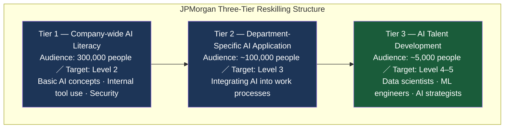

The critical design point: progression from Tier 1 to Tier 2 is **not automatic.** 
Completing Tier 1 training does not earn a ticket to Tier 2. 
Only employees who have demonstrably applied AI to their work and produced results advance.

"Completing the training" is not the passport to the next level. **"Proving results in actual work"** is.

### MUFG: The Light and Shadow of a 150,000-Person Diffusion Campaign

Mitsubishi UFJ Financial Group is running an AI diffusion campaign targeting 150,000 group employees.

MUFG's approach is less systematic than JPMorgan's, but notable for its scale as a Japanese financial institution. 
The group built AI tool access for all companies and appointed "AI promotion leaders" in each department.

But the challenges are clear.

**The selection criteria for AI promotion leaders tend to default to "technically proficient people" rather than "people who deeply understand the business."** 
**In contrast to JPMorgan's CEO-direct model analyzed in Chapter 2, MUFG's AI promotion is strongly IT-department-led.**

The structural outcome: AI promotion leaders can teach people "how to use the tools," but cannot propose "how to redesign the work processes" — a structural limitation built into the role from the start.

### Brynjolfsson's "Productivity J-Curve"

MIT's Erik Brynjolfsson explains the relationship between AI investment and productivity using the metaphor of the **"J-Curve."**

When general-purpose technologies — including AI — are adopted, productivity initially **falls.** 
The learning cost of acclimating employees to new tools. Temporary disruption to work processes. Running old systems in parallel with new ones. 
These factors cause short-term productivity decline.

Eventually, as the organization adapts to AI, work processes are redesigned, and complementary investments in talent development and organizational change begin to bear fruit, productivity **rises sharply.**

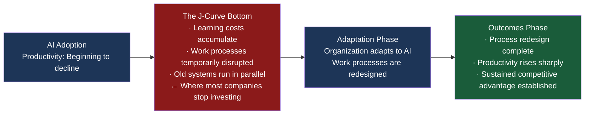

**The most dangerous decision leadership can make is to conclude "AI isn't producing results" during the J-Curve bottom and pull back the investment.**

Most companies stop their reform at the bottom of the J-Curve. Because they can't see results, they pull the investment and return to old work processes. 
But once a competitor has reached the right side of the J-Curve, there is no catching up.

**Reskilling results take time. If you don't have the resolve to endure the wait, it's better not to start.**

### The "Train and Forget" Syndrome

Drawing on the full analysis above, let's diagnose the "train and forget" syndrome that plagues Japanese companies:

| Symptom | Cause | Prescription |
|:---|:---|:---|
| High training completion, low work application | Classroom-heavy design | Shift to SoftBank method (work-connected) |
| Employees return to old work after training | Managers don't reward AI utilization | Build AI utilization depth into evaluation |
| Wide variance in progress across departments | Variable quality of AI promotion leaders | Place leaders who understand both business and AI |
| Loss of leadership support as short-term results fail to materialize | Insufficient understanding of the J-Curve | Establish agreement on investment-return timeline upfront |
| Ambiguous definition of "AI talent" | Undefined job roles | Define clearly using Section's four-tier model |

Reskilling should not be measured by "whether we did it" but by "whether it produced results." 
And producing results requires the time to endure the J-Curve bottom.

### References

1. SoftBank 2.5 Million AI Agents — Company-wide 100-agent-per-person program
   https://www.softbank.jp/biz/solutions/generative-ai/

2. GenAI HR Awards 2025 — SoftBank wins Grand Prix
   https://aismiley.co.jp/ai_news/genai-hr-awards-2025/

3. McKinsey "The State of AI in Early 2024" — 70% of reskilling participants ignore e-learning
   https://www.mckinsey.com/capabilities/quantumblack/our-insights/the-state-of-ai

4. JPMorgan Chase — $3B annual AI investment · 300,000-person reskilling plan
   https://www.jpmorgan.com/technology/artificial-intelligence

5. MUFG — 150,000-person group-wide AI diffusion campaign
   https://www.mufg.jp/csr/governance/

6. Erik Brynjolfsson "The Productivity J-Curve" — The J-Curve of AI investment and productivity
   https://www.nber.org/papers/w25148

 

## Chapter 6: Power Users and Frontier Professionals

In its 2024 Work Trend Index, Microsoft classified AI users into two categories:

**Power Users** and **Frontier Professionals.**

This distinction is the most important personnel strategy choice in the AI era.

### Power Users: Those Who Increase Volume

Power Users use AI to increase the **volume** of their output.

They have AI draft email replies. They use AI to auto-generate meeting minutes. They ask AI to write the first draft of a report. They hand data aggregation to AI.

The fundamental nature of a Power User's job has not changed from before AI. 
They are doing the same work, faster, in greater quantity. 
AI is being used as an "acceleration tool."

Power User productivity does increase — individual-level efficiency improvements of 30–50% are common. 
But the organizational-level impact is limited. If everyone processes emails 50% faster, it does not create competitive advantage.

### Frontier Professionals: Those Who Change the Game

Frontier Professionals use AI to **redesign** business processes themselves.

Their question is not "how can I use AI to do this work faster?" It is: "given that AI exists, shouldn't we fundamentally rethink how this work gets done at all?"

A Frontier Professional in customer support doesn't just deploy an AI chatbot to speed up responses. 
They use AI to analyze historical support records, identify patterns in recurring problems, and feed that intelligence back to the product development team — designing a system that reduces the volume of inquiries in the first place.

A Frontier Professional in marketing doesn't just use AI to generate large volumes of copy. 
They use AI to analyze customer segment behavioral patterns in real time, and rebuild what was a "campaign → measurement → improvement" cycle into a model of "continuous optimization."

| | Power User | Frontier Professional |
|:---|:---|:---|
| **Role of AI** | Acceleration tool for existing work | Leverage for redesigning work itself |
| **Direction of inquiry** | How can I use AI to do this faster? | Given AI, shouldn't we change this work entirely? |
| **Impact on productivity** | 30–50% improvement at individual level | Structural improvement at organizational level |
| **Impact on organization** | Limited (volume improvement) | Transformative (quality shift) |
| **Required skills** | AI tool proficiency | Business understanding + AI literacy + design thinking |
| **Section classification** | Dabbler to Practitioner | Advanced (3%) |

### CyberAgent: The Transformation of Creative Roles

Let's revisit the CyberAgent case from Chapter 3 — this time from a different angle.

After AI began generating large volumes of initial concepts for advertising creative, two kinds of creators clearly emerged in CyberAgent's creative division:

**Power User Creator:** 
Generates 100 concepts with AI, selects the good ones, makes minor adjustments. Production speed improves dramatically. 
But the "quality ceiling" of the creative work does not rise.

**Frontier Creator:** 
Analyzes AI outputs to extract the underlying structure of "why this pattern works." 
Feeds that structure back into AI inputs, raising the quality of the 100 concepts AI generates. 
Then analyzes correlations between advertising performance data and AI outputs to redesign the creative strategy.

The former remains a "producer." The latter has transformed into a **"director."**

CyberAgent embedded this transformation into its evaluation framework. 
"Direction capability" — the ability to critically evaluate AI outputs and give them direction — was redefined as the core competency of creative roles.

**AI is a magnifying glass that mercilessly exposes the absence of creative intelligence.**

After AI takes over "execution," what remains for humans is the judgment to decide *what* to create, and the vision to define *why* to create it. 
Creators who lack these will remain as AI operators. 
Those who have them will use AI to amplify their creative vision tenfold.

### The AI Auditor: The Birth of a New Specialty

In addition to Power Users and Frontier Professionals, a third new role is emerging: 
the **AI Auditor.**

As AI becomes embedded in the core of business processes, a specialist in verifying AI output quality becomes indispensable.

Traditional quality control was sampling-based: pull 5 from every 100 units and inspect them. 
But in AI-involved work processes, every output is different. 
The same prompt produces a different response every time. Sampling cannot guarantee quality.

The AI Auditor conducts **100% full-volume auditing** of AI outputs. 
Not by manually reviewing every item — but by designing a system in which a verification AI automatically screens all outputs, and only anomalies are flagged for human review.

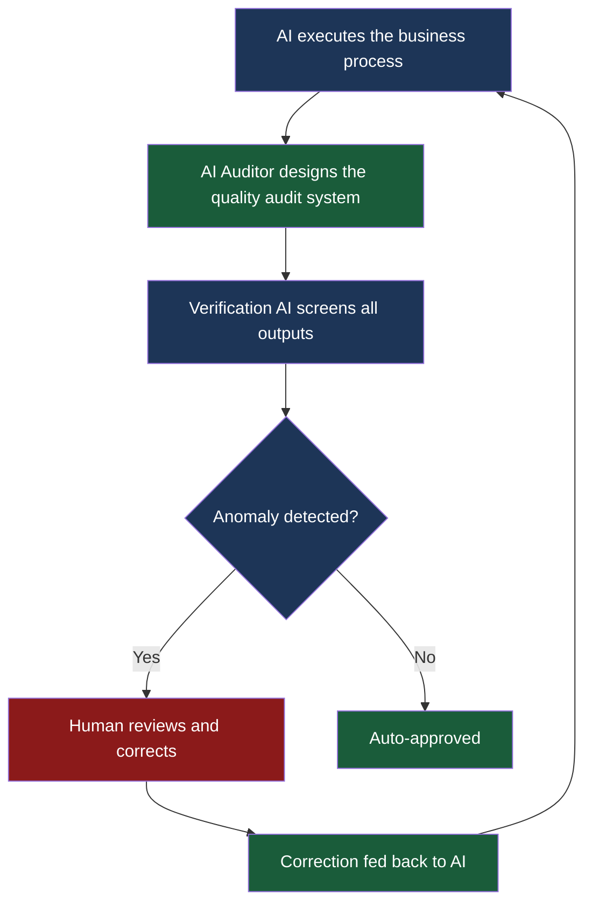

The AI Auditor is a third category — distinct from both Power User and Frontier Professional. 
Neither blindly trusting AI outputs nor blanket rejecting them, but **systematically verifying** them.

### The Question This Distinction Forces onto Evaluation Systems

Power Users. Frontier Professionals. AI Auditors. 
None of these three roles exist in traditional job definitions.

Power Users can be described as "traditional role + AI tools." 
But Frontier Professionals and AI Auditors require entirely new job definitions.

And as Chapter 3 established: without job definitions, there are no evaluation criteria. 
Without evaluation criteria, there is no compensation structure. 
Without a compensation structure, the people fulfilling these roles will not receive fair recognition inside the organization.

The next chapter defines the ultimate form of the Frontier Professional — the Orchestrator.

### References

1. Microsoft Work Trend Index 2024 — The Power User / Frontier Professional classification
   https://www.microsoft.com/en-us/worklab/work-trend-index/

2. CyberAgent — The transformation of creative roles after AI adoption
   https://www.cyberagent.co.jp/techinfo/ai/

3. Section "State of AI at Work 2024" — Advanced tier at just 3%
   https://www.section.com/state-of-ai-at-work

 

## Chapter 7: The Orchestrator — The One Who Stands Between AI and Human Beings

Power Users use AI to make their own work faster. 
Frontier Professionals use AI to redesign business processes.

But the role of **designing the organization's overall AI strategy and architecting the collaboration between humans and AI** still has no name.

This chapter gives that role a name — **Orchestrator** — and defines it.

### Why Existing Roles Aren't Enough

Multiple existing roles engage with AI strategy: 
CTO, CDO (Chief Digital Officer), data scientists, ML engineers, AI product managers.

But all of these roles share a common limitation: **they see the organization from the technology side.**

The CTO judges AI through the lens of infrastructure and architecture. 
The data scientist judges through the lens of model accuracy and data quality. 
The AI product manager judges through the lens of user experience and feature requirements.

All of these perspectives are correct. But all of them are partial.

Transforming an organization through AI requires a perspective that sees technology, business strategy, organizational design, talent development, and evaluation systems **all at once.** 
As the DeNA–Klarna contrast in Chapter 1 showed: even correct technology decisions can produce the opposite result if organizational design is wrong.

The Orchestrator is not a technologist. Not an executive. 
**The Orchestrator is the person who stands between AI and human beings and designs their collaboration.**

### The Three Competencies of the Orchestrator

The competencies required of an Orchestrator live at the intersection of three domains:

**1. Understanding of Business Strategy** 
The ability to identify where AI can deliver maximum impact on the business. 
Selecting AI application domains based on a structural understanding of customer value, competitive advantage, and revenue models.

**2. Deep Structural Understanding of Technology** 
Code-writing is not required. 
But a structural understanding of LLM capabilities and limits, agent design principles, and data pipeline architecture is essential. 
Enough understanding to ask the right questions of technical specialists.

**3. The Ability to Design Organizations and People** 
The ability to predict the organizational impact of AI adoption, and to redesign evaluation systems, job definitions, team composition, and work processes accordingly. 
The resolution to address the evaluation challenges of Chapter 3 and the Japanese organizational pathologies of Chapter 4.

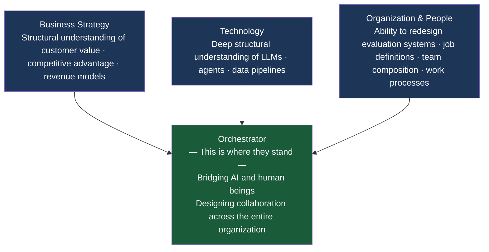

People who hold all three simultaneously are extraordinarily rare right now. 
"BTC talent" (Business × Technology × Creative) — people who understand both business strategy and technology — exist. 
But people who can stand at the center of the triangle that adds "the ability to design organizations and people" are rare globally.

### 10:80:10 — The Human-AI Collaboration Ratio

At the center of the collaboration model Orchestrators implement across organizations is **the 10:80:10 rule.**

| Ratio | Agent | Role |
|:---|:---|:---|
| First 10% | Human | Framing the question, constructing the context, determining direction |
| Middle 80% | AI | Research, analysis, drafting, pattern extraction, execution |
| Final 10% | Human | Critical verification, quality assurance, decision-making, taking responsibility |

The first 10% is the most critical. AI cannot decide what question to solve. 
Framing the question, designing the context, defining what you are asking AI to do — this is the human's work.

AI handles the middle 80%. But this is not "handing everything to AI." 
It means checking AI outputs along the way, correcting direction, and providing additional context. Within that 80%, multiple human intervention points exist.

The final 10% means critically evaluating AI outputs and making the ultimate decision: 
whether to use the output as is, to revise it, or to reject it. And taking responsibility for that judgment.

The Orchestrator's work is to **implement this 10:80:10 process across the entire organization** — 
not just in individual tasks, but across interdepartmental collaboration, decision-making flows, and quality management processes.

### Context Engineering

The technical foundation of the Orchestrator's work is **context engineering.**

The largest variable determining AI output quality is not the model's capability. It is **the design of the context.**

Ask the same GPT-4 or Claude the same question, and the output will differ dramatically depending on how much context you provide. 
"Propose a marketing strategy" versus "Propose a marketing strategy for a B2B SaaS company in the growth phase from ¥100M to ¥1B ARR, addressing the rising customer acquisition cost faced by the enterprise sales team, drawing on six months of customer data" — the value generated differs by a factor of ten.

Context engineering is not a technique for "writing better prompts." 
It is **a methodology for structurally designing the context to be given to AI, based on domain knowledge and business understanding.**

The Orchestrator structures the organization's domain knowledge, business data, and customer information, and designs the context in which AI can deliver maximum value. 
This is a technical skill — but it is equally a skill that is impossible without deep business understanding.

### What the Absence of an Orchestrator Causes

What happens in organizations without an Orchestrator? Let's revisit the cases in this book:

**Klarna:** 
AI substitution was driven from the technology side. With no one to design the mechanisms by which humans complement AI, the customer experience was damaged.

**"Metrics theater" companies:** 
AI adoption metrics are the only things getting reported. With no one to design business impact, no one can answer the CFO's question.

**Japan's "train and forget" companies:** 
Reskilling programs run. But with no one to redesign work processes, employees return to their old work after training.

Common to every case: **the absence of a human being who bridges technology and organization.**

### References

1. "The Orchestrator in the AI Era" — Orchestrator definition and the 10:80:10 framework
   https://github.com/Leading-AI-IO/the-orchestrator-in-the-ai-era

2. "Depth & Velocity" — Context engineering and human × AI collaboration methodology
   https://github.com/Leading-AI-IO/depth-and-velocity

3. Microsoft Work Trend Index 2024 — Role redefinition in the AI era
   https://www.microsoft.com/en-us/worklab/work-trend-index/

 

## Chapter 8: The Design Principles of an AI-First Organization

The chapters up to this point have dissected the problems AI-era organizations face. This chapter presents **the solutions.**

## HBS "The Jagged Frontier" — The Uneven Boundary Between What AI Can and Cannot Do

The Harvard Business School research team explains AI's capability using the metaphor of the "Jagged Frontier" — a jagged, uneven boundary line.

In some domains, AI surpasses humans by a wide margin. In others, it falls short of a young child. The boundary is not smooth — it's serrated.

For example: GPT-4 performs in the top 10% of bar exam results, but cannot explain why a joke is funny with the facility of an ordinary human. 
Its ability to extract patterns from massive datasets is superhuman. But its ability to judge "can this data be trusted?" does not match a human's.

Accurately mapping this jagged frontier is the starting point for AI-first organizational design.

**Deploy AI fully in the domains where AI excels (the peaks).** 
**Place humans in the domains where AI falls short (the valleys). And place the Orchestrator at the boundary between peaks and valleys.**

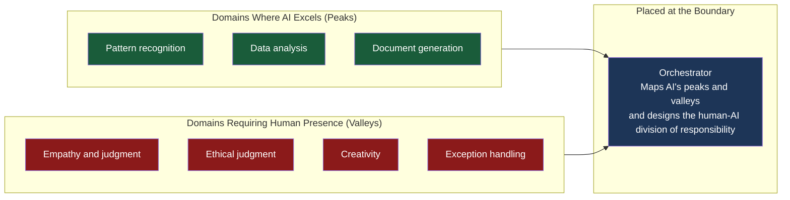

### BCG's "North Star → Lighthouse → Scale" Roadmap

BCG proposes a three-stage roadmap for AI organizational transformation:

**Stage 1: Setting the North Star** 
Define at the business strategy level what you want to achieve with AI. 
"AI adoption" is not a North Star. "Use AI to redefine the customer experience and grow market share by 10% in three years" is.

**Stage 2: Executing Lighthouse Projects** 
Run limited but high-impact pilot projects aimed at the North Star. 
Before company-wide deployment, create a success case in one department, one workflow. 
This lighthouse shows the whole company: "this is how AI produces results."

**Stage 3: Scaling** 
Deploy the lighthouse success company-wide. 
It is only at this stage that full-scale reform of organizational structure, evaluation systems, and talent development becomes necessary.

Most companies try to skip Stage 1 and go directly to Stage 3. 
Without defining the North Star, they distribute Copilot licenses to everyone. 
The result is exactly what the prologue described — metrics theater.

### Seven-Dimensional Simultaneous Transformation

The transition to an AI-first organization cannot be achieved by any single initiative. The following seven dimensions must be transformed **simultaneously:**

| Dimension | Content of Transformation | Corresponding Chapter |
|:---|:---|:---|
| 1. Strategy | Define the AI utilization North Star | Prologue |
| 2. Organizational structure | Flattening, direct CEO authority over AI | Chapter 2 |
| 3. Evaluation system | Quantified AI utilization assessment, shift to outcome evaluation | Chapter 3 |
| 4. Talent development | Work-connected reskilling, three-tier structure | Chapter 5 |
| 5. Job definitions | Power User / Frontier / Orchestrator distinction | Chapters 6–7 |
| 6. Work processes | 10:80:10 implementation, AI output quality management | Chapter 7 |
| 7. Culture | Leadership visibly uses AI; failure is tolerated | Chapters 1, 4 |

Changing only one of the seven produces limited results. 
Change the evaluation system without changing work processes, and employees are "evaluated but can't execute." 
Change the organizational structure without changing the culture, and old behaviors repeat on a new org chart.

**Move all seven dimensions, in the same direction, at the same time. That is the essence of the transition to an AI-first organization.**

### Implementation Checklist

To close this chapter, here is an implementation checklist for executives considering the transition to an AI-first organization:

**Strategy**

- [ ] Have you defined, in numerical terms, the business objective (North Star) you want to achieve with AI?
- [ ] Is that objective connected to the KPIs of business divisions — not just the AI division?

**Organizational Structure**

- [ ] Is AI promotion happening under direct CEO authority (or equivalent)?
- [ ] Are you reviewing the middle management layer whose primary work is information relay and progress tracking?

**Evaluation System**

- [ ] Have you introduced a metric (such as DARS) that quantitatively measures AI utilization depth?
- [ ] Are you evaluating quality of outcomes rather than volume of outputs?
- [ ] Is AI talent compensation aligned with market rates?

**Talent Development**

- [ ] Is reskilling designed as work-connected — not classroom-based?
- [ ] Does leadership have consensus on the investment timeline required to endure the J-Curve bottom?

**Job Definitions**

- [ ] Have you distinguished between Power Users and Frontier Professionals?
- [ ] Is the Orchestrator role explicitly defined within the organization?

**Work Processes**

- [ ] Does a mechanism (AI Auditor) exist to verify AI output quality?
- [ ] Is the 10:80:10 collaboration model implemented in core work processes?

**Culture**

- [ ] Does the top executive personally use AI in their daily work?
- [ ] Is a culture in place where AI utilization failures do not negatively impact evaluations?

### References

1. HBS "Navigating the Jagged Technological Frontier" — The uneven capability frontier of AI
   https://www.hbs.edu/faculty/Pages/item.aspx?num=64700

2. BCG "North Star → Lighthouse → Scaling" — AI organizational transformation roadmap
   https://www.bcg.com/publications/2024/maximizing-return-on-ai-investments

3. California Management Review "Six Principles for Responsible AI" — Design principles for AI-first organizations
   https://cmr.berkeley.edu/

4. Gartner "AI Organization Design 2025" — Seven-dimensional simultaneous transformation framework
   https://www.gartner.com/en/articles/ai-organization-design

 

## Epilogue: Human Dignity

DeNA Chairman Tomoko Namba posed this question at a conference:

**"When the time comes that AI is the one assigning work to human beings, where does human dignity reside?"**

This question underlies every discussion this book has engaged.

Performance evaluation systems express, through what they choose to measure, "what kind of human beings this organization values."

An organization that measures lines of code values people who write fast. 
An organization that measures business impact values people who think and act. 
An organization that measures nothing does not value people at all.

Redesigning performance evaluation for the AI era is not a technical challenge of "measuring AI's contribution correctly." 
**It is a fundamentally human question: how do we define the value of human beings who work alongside AI?**

Klarna admitted "we went too far." 
By replacing humans with AI, they lost, at the point of customer contact, the things only humans can do.

DeNA declared "we will liberate humans with AI and redirect them toward what only humans can do."

Shopify imposed on every employee "the obligation to explain why their work cannot be replaced by AI."

Three companies chose three different approaches. But the question all three are confronting is the same:

**What will humans do — that AI cannot?**

BCG says "humans are the source of differentiation." 
Deloitte proposed the concept of the "Human-Agentic Workforce" — a workforce in which humans and AI agents collaborate. 
McKinsey analyzed that "designing the complementary relationship between AI and humans determines corporate competitive advantage."

All of this is correct. But none of it is sufficient.

Because all of these analyses speak from the perspective of "organizational performance." 
Humans complement AI, so organizational productivity rises. 
Human judgment compensates for AI's weaknesses, and total output is maximized.

But human beings are not "components that exist to serve organizational performance."

---

All of the structural analysis this book has presented — the collapse of evaluation systems, the pathologies of Japanese organizations, the illusion of reskilling, the definition of new roles — ultimately converges on a single question:

**Can an organization treat, with dignity, the human beings who work alongside AI?**

**After AI takes over "execution," what remains for human beings is "framing the question," "making judgments," and "taking responsibility."** 
These are the things only humans can do — and they are also the things closest to the essence of what it means to be human.

Technology is ready. Model capability is high enough. 
The question now is how the human collective we call an organization will move, alongside that technology, toward "more deeply human work."

The person who designs that movement is the Orchestrator.

And the person who grants permission for that design is the executive.

**The only entity that can make the decision to rewrite the organization's operating system is a human being.**

### References

1. DeNA Tomoko Namba — "Human dignity in an era when AI assigns work to humans"
   https://dena.com/jp/ir/

2. BCG "AI at Work: Friend and Foe" — "Humans are the source of differentiation"
   https://www.bcg.com/publications/2024/ai-at-work-friend-and-foe

3. Deloitte "Human-Agentic Workforce" — The concept of human-AI agent collaboration
   https://www.deloitte.com/global/en/issues/work/content/genai-and-the-future-of-work.html

4. McKinsey "The State of AI in Early 2024" — The human-AI complementary relationship
   https://www.mckinsey.com/capabilities/quantumblack/our-insights/the-state-of-ai

 

## Author & Maintainer

**Satoshi Yamauchi** (山内 怜史)
*(AI Strategist & Business Designer)*
**[📒 Read my insights on Note](https://note.com/satoshi_yamauchi)**
*(Founder / AI Strategist at Leading.AI)*
**[🌐 Visit Leading.AI Official Website](https://www.leading-ai.io/)**

## License

This work is licensed under [Creative Commons Attribution 4.0 International (CC BY 4.0)](http://creativecommons.org/licenses/by/4.0/).
You are free to share and adapt this material, provided you give appropriate credit to **Satoshi Yamauchi / Leading AI**.
