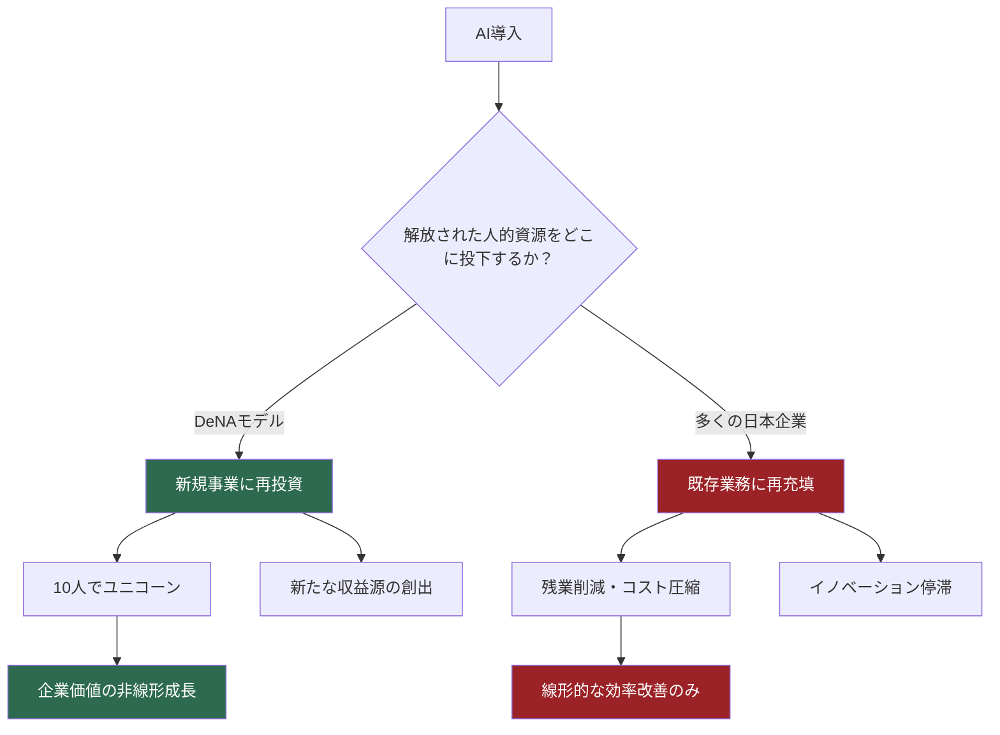
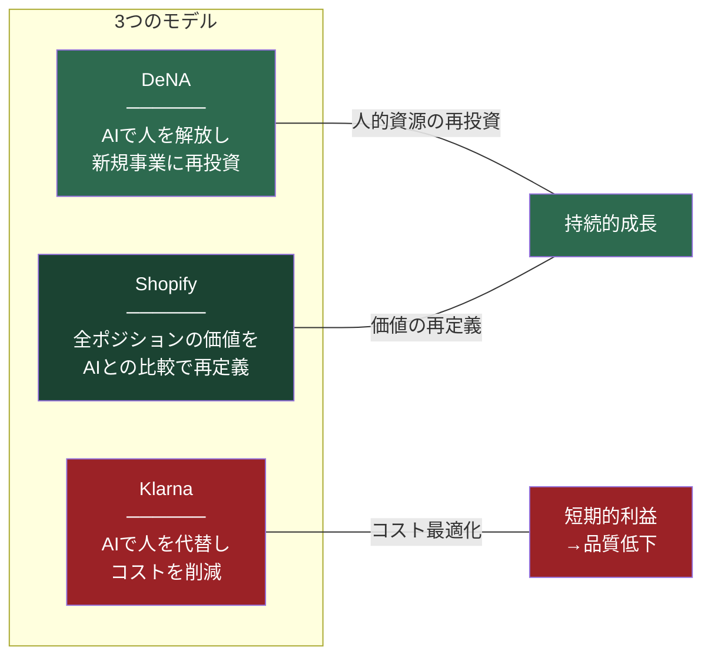
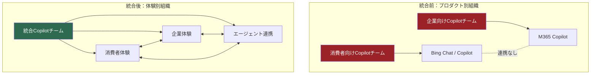
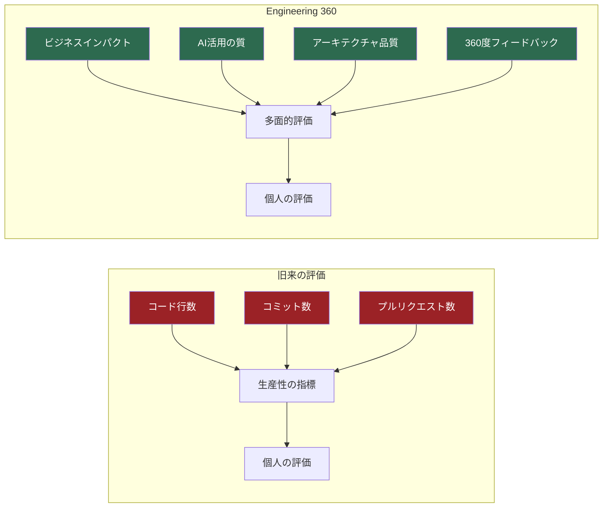
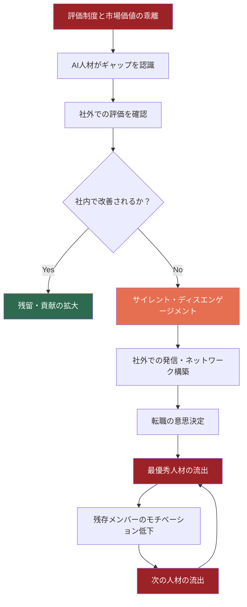
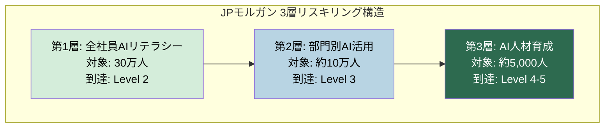
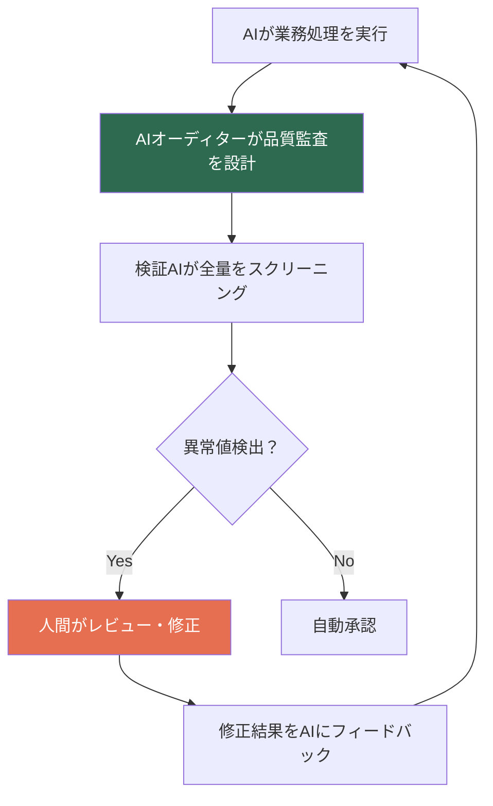

# The AI Organization
AI時代の組織論。<br>
AI導入が失敗する本質は技術ではなく組織にある。リーダーシップ・文化・評価制度の構造分析。

[](https://creativecommons.org/licenses/by/4.0/)
[](docs/)

<p align="left">
  
</p>

<br>

# 序章: 70%の真実

---

2024年、ボストン コンサルティング グループ（BCG）は、AI導入に関する1つの調査結果を発表した。

その調査によれば、AIがもたらす価値のうち、テクノロジーそのもの——アルゴリズムやモデル——が生み出す価値は、全体のわずか**10%**に過ぎない。データの整備やインフラの構築が**20%**。そして残りの**70%**は、人と組織のリデザインから生まれる。

10-20-70の法則。

この数字を見た瞬間、多くの経営者は違和感を覚えるだろう。なぜなら、現在ほぼ全ての企業が、10%と20%に投資を集中させているからだ。最新のLLMを導入し、データパイプラインを整備し、PoC（概念実証）を量産する。そして「AI導入率92%」「月間プロンプト実行数1万回」といった数字をボードに報告する。

だが、CFOの問いには答えられない。

**「それで、いくら稼いだのか？」**

McKinseyが2024年に実施した調査では、生成AIのKPI（重要業績評価指標）を追跡している企業は、全体の**20%未満**だった。IBMの調査では、AIのROI（投資対効果）を測定できている企業は**29%**に留まる。

組織はAIを「導入」している。しかし、AIで「価値を創出」してはいない。

この乖離の原因は、テクノロジーにはない。組織にある。

---

## なぜ、組織の問題は見えにくいのか

テクノロジーの導入は可視化しやすい。APIの契約数、モデルのバージョン、処理速度、応答精度。全て数字になる。ダッシュボードに表示できる。経営会議で報告できる。

一方、組織の問題は可視化しにくい。

「AI人材を採用したが、既存の評価制度では正当に評価できず、1年で退職した」——この事象は、人事データベースには「自己都合退職」とだけ記録される。

「全社員にCopilotのライセンスを配布したが、6ヶ月後に日常業務で使っているのは3%だった」——この事象は、IT部門のレポートには「ライセンス稼働率」として記録されるが、なぜ97%が使わないのかは記録されない。

「AI推進チームのリーダーに抜擢した人材が、既存事業部門との軋轢で孤立し、提案が全て棚上げされた」——この事象は、どこにも記録されない。

BCGの70%が見えにくいのは、組織の問題が「誰かの責任」として矮小化されるからだ。テクノロジーの失敗はシステム障害として全社に共有されるが、組織の失敗は個人のパフォーマンスとして処理される。

```
┌─────────────────────────────────────────────────────┐
│           AIが生む価値の構造（BCG 10-20-70）            │
├─────────────────────────────────────────────────────┤
│                                                     │
│  ┌──────────┐                                       │
│  │Technology│ 10%  ← ほぼ全ての企業が               │
│  │ アルゴリズム │       ここに投資を集中               │
│  └──────────┘                                       │
│  ┌──────────┐                                       │
│  │  Data    │ 20%  ← データ基盤・インフラ整備        │
│  │ データ整備 │                                       │
│  └──────────┘                                       │
│  ┌──────────────────────────────────────────┐       │
│  │                                          │       │
│  │        People & Organization             │       │
│  │        人と組織のリデザイン                 │       │
│  │                                          │ 70%   │
│  │   評価制度 / 職種定義 / 組織構造 /          │       │
│  │   リスキリング / カルチャー / インセンティブ   │  ←放置 │
│  │                                          │       │
│  └──────────────────────────────────────────┘       │
│                                                     │
└─────────────────────────────────────────────────────┘
```

---

## 「メトリクス・シアター」の蔓延

Salesforceのエンジニアリング部門は、2024年に「Engineering 360」という社内評価改革に着手した。きっかけは、AIコーディングツールの導入後、開発者がAIに大量のコードを生成させ、コード行数という従来の生産性指標が意味を失ったことだった。コードの「量」は爆発的に増えたが、品質や事業インパクトとの相関が崩壊した。

これは一企業の話ではない。AI導入後の組織に広がる「メトリクス・シアター」——数字の上では成功しているように見えるが、実態は何も変わっていない状態——の典型例だ。

| 報告される指標 | 問われるべき問い |
|:---|:---|
| AI導入率 92% | 業務プロセスは変わったか？ |
| 月間プロンプト実行数 10,000回 | 意思決定の質は上がったか？ |
| Copilotライセンス全社配布 | 日常的に使っている社員は何%か？ |
| AI関連特許出願数 +40% | 収益に繋がった特許はいくつか？ |
| 社内AIハッカソン参加者 500名 | ハッカソン後に業務適用された件数は？ |

数字は嘘をつかない。だが、数字は「何を測るか」によって、真実を隠すことができる。

---

## 本書の構造

本書は、AIが組織に突きつけている構造的な問いを、9つの章で解体する。

**第1章**では、DeNAとKlarnaという2つの企業が、同じ「AIファースト」を掲げながら正反対の結末に向かった対照実験を分析する。AIで解放された人的資源を「新規事業」に再投資するモデルと、「コスト最適化」だけで突っ走るモデルの構造的差異を明らかにする。

**第2章**では、Amazon、Google、Microsoft、NVIDIAといったテクノロジー企業が進める組織のフラット化を追う。中間管理職の50%がAIに吸収されるというGartnerの予測は、単なる人員削減の話ではない。意思決定構造そのものの変容だ。

**第3章**は、本書の核心である。「メトリクス・シアター」——AIの成果を測定できない評価制度の構造的破綻——を解剖する。評価制度がAI時代の価値創造と噛み合わない企業は、高価値人材から順番に流出する。

**第4章**では、日本企業固有の構造的病理に切り込む。南場智子が語った「真面目さのパラドックス」、LINEヤフーが「義務化」せざるを得なかった背景、年功序列と職能資格がAI人材の評価と矛盾する三重構造。

**第5章**では、リスキリングの幻想と現実を直視する。ソフトバンクが2ヶ月半で250万のAIエージェントを全社員に構築させた事例と、大多数の企業で起きている「研修して終わり」の実態。

**第6章**では、AI時代に出現する新しい職種——「パワーユーザー」と「フロンティア・プロフェッショナル」の峻別を論じる。AIのアウトプットの量を上げる者と、ビジネスプロセスそのものを再設計する者は、根本的に異なる存在だ。

**第7章**では、AIと人間の間に立つ「オーケストレーター」という役割を定義する。

**第8章**では、AIファースト組織の設計原則を理論と実践の両面から提示する。

そして**終章**では、南場智子が投げかけた問い——「AIに仕事を発注される時代の、人間の尊厳とは何か」——に向き合う。

---

## この本を書いた理由

私は、ビジネス、テクノロジー、クリエイティブの3領域を越境してきたキャリアを持つ。ITコンサルティング、事業開発、デザインシンキング。その交差点で見えたものがある。

**AIの導入が失敗するとき、技術は関係ない。**

失敗するのは、経営層がAIを「技術導入」として扱い、組織設計の問題として捉えないときだ。AI人材を正当に評価できないときだ。評価制度がAI時代の価値創造と噛み合わないときだ。フィードバックを7ヶ月間与えず、本人が撤退を提案した瞬間に「もっとやるべきだった」と後出しするマネジメントが許容されるときだ。

この本は、特定の企業への批判ではない。構造の解剖だ。

BCGが提示した70%の中身を、具体的な事例と構造分析で明らかにすること。それが本書の目的である。

---

### 引用

1. BCG「Maximizing Return on AI Investments」 — AI価値創出における人・組織の比重（10-20-70の法則）
   https://www.bcg.com/publications/2024/maximizing-return-on-ai-investments

2. McKinsey「The state of AI in early 2024」 — 生成AIのKPI追跡企業は20%未満
   https://www.mckinsey.com/capabilities/quantumblack/our-insights/the-state-of-ai

3. IBM「Global AI Adoption Index 2024」 — ROI測定企業29%
   https://www.ibm.com/thought-leadership/institute-business-value/en-us/report/ai-adoption

4. Salesforce「Engineering 360」 — AIコーディングツール導入後の評価改革
   https://www.salesforce.com/news/stories/ai-engineering-productivity/
-e 

---


# 第1章: 光と影 — DeNAとKlarnaの対照実験

---

2024年、2つの企業が、ほぼ同時期に「AIファースト」を宣言した。

1つは、日本のインターネット企業DeNA。もう1つは、スウェーデン発のフィンテック企業Klarna。

両社はともに、AIを全社戦略の中核に据え、組織を根本から再構築しようとした。使っている言葉も似ている。「AI-first」「全社員がAIを使う」「業務効率の劇的改善」。

だが、1年後の結末は正反対だった。

---

## DeNA: 「10人でユニコーン」という逆転の発想

DeNAの会長・南場智子は、2024年の決算説明会でこう語った。

**「AIによって浮いた時間を、既存業務の効率化ではなく、新規事業に再投資する。」**

この一文は、一見すると当たり前のことを言っているように聞こえる。だが、南場が指摘したのは、日本企業の多くが陥る構造的な罠だった。

AIで業務時間が30%削減される。すると、真面目な日本の社員は何をするか。空いた30%に、別の既存業務を詰め込む。残業が減り、業務量あたりのコストが下がる。CFOは満足する。だが、何も新しいものは生まれていない。

南場はこれを「**効率化パラドックス**」と呼んだ。

DeNAが選んだのは、別の道だった。AIによって解放された人的資源を、意図的に新規事業の創出に振り向ける。社内では「**10人でユニコーン**」というスローガンが掲げられた。AIをレバレッジとして使えば、かつて100人必要だった事業開発を、10人で回せる。その10人が生み出す事業が、ユニコーン級の価値を持つ——という構想だ。

同時にDeNAは、**DARS（DeNA AI Readiness Score）**という独自の評価指標を導入した。全社員のAI活用度を定量的に測定し、部門ごとのAI成熟度を可視化する仕組みだ。これは「導入した」ではなく「使いこなしている」を測る設計思想であり、序章で述べた「メトリクス・シアター」への明確なアンチテーゼだった。

さらに、南場自身が全社員の前でAIツールを操作して見せた。会長がプロンプトを書き、AIの出力を評価し、修正する。トップ自らが「AIを使い倒す姿」を見せることで、全社の行動変容を駆動した。



---

## Klarna: 「やりすぎた」と認めたCEO

同じ2024年、Klarnaは世界で最もアグレッシブなAI組織変革を断行した。

CEOのセバスチャン・シミアトコウスキは、AIを使って従業員数を**5,527人から2,907人**に削減した。ほぼ半減だ。採用を完全に凍結し、自然減とAI代替で人員を圧縮した。

結果は数字の上では眩しかった。

- 収益: **108%増**
- 従業員一人あたり収益: **大幅に改善**
- 平均給与: **60%増**（残った社員への還元）
- カスタマーサービス: AIチャットボットが**700人分の業務を代替**
- マーケティング: 外部エージェンシーへの支出を**大幅削減**

ウォール街は歓喜した。Klarnaの企業価値は急回復し、IPOへの道が開けた。シミアトコウスキは「AIネイティブ企業」の旗手として世界中のカンファレンスに招かれた。

だが、2025年初頭、彼は予想外の告白をした。

**「We went too far.（やりすぎた。）」**

何が起きたのか。

顧客満足度が低下していた。AIチャットボットは定型的な問い合わせには対応できたが、複雑な問題や感情的なクレームには対処できなかった。人間のオペレーターが介入すべき場面で、AIが対応を続けた結果、顧客体験が毀損された。

Klarnaは採用を再開し、人間のカスタマーサービス担当者を再び雇い始めた。

---

## 2つのモデルの構造的差異

DeNAとKlarnaの違いは、AIの「性能」の差ではない。**組織設計の思想**の差だ。

| | DeNA | Klarna |
|:---|:---|:---|
| **AIの位置づけ** | 人的資源を解放するレバレッジ | 人的資源を代替するツール |
| **解放された資源の投下先** | 新規事業の創出 | コスト削減・利益率改善 |
| **人員への影響** | 配置転換・新規事業への再投資 | 大規模削減（5,527→2,907） |
| **評価制度** | DARS（AI活用度の定量評価）導入 | 従来の収益指標のまま |
| **トップの行動** | 南場会長が自らAIを操作して見せる | CEOが削減の成果を対外発信 |
| **1年後の結果** | 新規事業パイプライン構築 | 顧客満足度低下→採用再開 |

Klarnaの失敗は、AIの性能が不足していたからではない。組織設計において、**人間がAIを補完する仕組み**を設計しなかったからだ。

700人分の業務をAIで代替した。だが、700人が持っていた「判断力」「共感力」「例外処理能力」は代替されなかった。それらの能力が必要な場面で、AIは沈黙するか、的外れな応答を返した。

---

## Shopify: 第3の道

この対照実験に、もう1つの視点を加える。

カナダのeコマースプラットフォームShopifyは、2025年初頭に全社的な方針を発表した。

**「新規の人員採用を申請する場合、そのタスクがAIで代替できない理由を証明しなければならない。」**

CEOのトビアス・リュトケが全社員に送ったメモの趣旨だ。

これはKlarnaのような「AIで人を削減する」アプローチとは本質的に異なる。Shopifyが求めているのは、**全てのポジションの価値を、AIとの比較で再定義すること**だ。

「この仕事は人間がやるべきか、AIがやるべきか」を問うのではない。「この仕事を人間がやることで、AIにはできないどんな価値が生まれるか」を問うている。

この問いは、組織内の全てのポジションに突きつけられる。マネージャーにも、エンジニアにも、デザイナーにも、営業にも。そして、AIで代替できない理由を説明できないポジションは、そもそも存在する必要がない。



---

## この章の教訓

AIファーストを宣言すること自体には、価値はない。問われるのは、AIが組織の中で**何を解放し、何を代替し、何を再定義するのか**という設計だ。

DeNAは「解放」を選んだ。Klarnaは「代替」を選んだ。Shopifyは「再定義」を選んだ。

3つのアプローチは排他的ではない。だが、組織が最初に選ぶ思想が、その後の全ての意思決定を方向づける。「コスト削減」から入った組織は、AIを人件費の代替変数として扱い続ける。「価値創出」から入った組織は、AIを新たな事業機会のレバレッジとして扱い続ける。

本書が問うのは、あなたの組織はどちらを選んでいるか、だ。

---

### 引用

1. DeNA 南場智子「AIオールイン宣言」 — 2024年度決算説明会
   https://dena.com/jp/ir/

2. DeNA DARS（DeNA AI Readiness Score） — 全社AI活用度評価指標
   https://dena.com/jp/article/004252/

3. Klarna CEO Sebastian Siemiatkowski「We went too far」 — Bloomberg interview, 2025
   https://www.bloomberg.com/news/articles/2025-02-20/klarna-ceo-says-utilitarian-utilitarian-utilitarian-ai-approach-went-too-far

4. Klarna AI Assistant — 700人分の業務代替実績
   https://www.klarna.com/international/press/klarna-ai-assistant-handles-two-thirds-of-customer-service-chats-in-its-first-month/

5. Shopify CEO Tobi Lütke — 全社メモ「AIで代替できない理由の証明義務」
   https://twitter.com/toaborern/status/1907090292748984538

6. BCG「AI at Work: Friend and Foe」 — 人間こそが差別化の源泉
   https://www.bcg.com/publications/2024/ai-at-work-friend-and-foe
-e 

---


# 第2章: 組織図の終焉

---

2024年から2025年にかけて、世界のテクノロジー企業で、ある共通のパターンが観測された。

Amazonは**3万人以上**を削減した。Googleは、傘下のDeepMindとGoogle Brainを統合し、AI研究部門を一本化した。Microsoftは、消費者向けCopilotと企業向けCopilotの組織を統合し、AIエージェント戦略を一元化した。NVIDIAのジェンスン・フアンCEOは、「自分に直接レポートする人数は60人」と公言し、従来の階層型組織を意図的に否定した。

これらは個別の人事施策ではない。**組織構造そのものの地殻変動**だ。

---

## 中間管理職の50%が消える

Gartnerは2024年の予測レポートで、衝撃的な数字を提示した。

**「2026年までに、大企業の中間管理職ポジションの50%以上が、AIによって排除されるか、根本的に再定義される。」**

中間管理職の主要な業務を分解すると、その多くがAIの得意領域と重なることが分かる。

| 中間管理職の主要業務 | AIによる代替可能性 |
|:---|:---|
| 情報の集約と上位への報告 | **高** — ダッシュボード・自動レポート生成 |
| 部下の業務進捗の管理 | **高** — プロジェクト管理ツール・AIアシスタント |
| 定型的な意思決定 | **高** — ルールベース＋LLMによる判断支援 |
| 部門間の情報伝達・調整 | **中〜高** — AIエージェントによる自動連携 |
| 部下の育成・メンタリング | **低** — 人間の関与が不可欠 |
| 例外的・政治的な判断 | **低** — 文脈理解と組織力学の把握が必要 |

上から4つは、AIが既に実用レベルで代替可能だ。下の2つは、当面は人間にしかできない。

問題は、多くの中間管理職が「上の4つ」で業務時間の大半を費やしていることだ。情報を集め、整理し、上に報告する。部下のタスクを確認し、遅延があれば催促する。隣の部署と調整する。これらがAIに吸収されたとき、中間管理職に残る業務は「育成」と「例外判断」だけになる。

その2つだけで、ポジションを正当化できるか。

---

## NVIDIA: 「組織なき組織」の実験

NVIDIAのジェンスン・フアンは、シリコンバレーで最もラディカルな組織論を実践している経営者の一人だ。

彼に直接レポートする人数は**60人**。一般的な経営学の教科書は、CEOの直属部下（スパン・オブ・コントロール）を7±2人と推奨する。フアンはその10倍だ。

フアンの論理はこうだ。階層が深くなるほど、情報は劣化する。現場の情報がCEOに届くまでに3層を通過すれば、3回フィルタリングされ、3回「報告に適した形」に加工される。その結果、CEOが見ているのは現実ではなく、現実の要約の要約の要約だ。

AIがリアルタイムで全社の情報を集約・可視化できる時代に、なぜ情報の中継点としての中間管理職が必要なのか。

NVIDIAの組織は「**情報の民主化**」を前提に設計されている。全社員がほぼ同じ情報にアクセスでき、CEOが直接現場のエンジニアと対話する。その結果、意思決定の速度が劇的に上がる。

ただし、これはNVIDIAが半導体設計という**高度に専門的な単一事業**に集中しているからこそ機能する。多角化した大企業が同じモデルを導入すれば、CEOの認知負荷が限界を超える。フアンの組織論は「正解」ではなく、「AIが情報伝達を代替した場合に何が可能になるか」の極限形を示している。

```
┌─────────────────────────────────────────────────┐
│             従来の階層型組織                        │
│                                                 │
│                  CEO                            │
│                 ╱   ╲                           │
│              VP       VP                        │
│            ╱   ╲    ╱   ╲                       │
│         Dir    Dir Dir    Dir                   │
│        ╱ ╲   ╱ ╲ ╱ ╲   ╱ ╲                     │
│      Mgr...         ...Mgr                     │
│     ╱ ╲                 ╱ ╲                     │
│   IC   IC             IC   IC                   │
│                                                 │
│   情報は5層を通過し、5回フィルタリングされる           │
└─────────────────────────────────────────────────┘

┌─────────────────────────────────────────────────┐
│             NVIDIAモデル                          │
│                                                 │
│                  CEO                            │
│       ╱  ╱  ╱  │  ╲  ╲  ╲                      │
│     ○  ○  ○  ○  ○  ○  ○    ← 60人が直接報告     │
│    ╱╲ ╱╲ ╱╲ ╱╲ ╱╲ ╱╲ ╱╲                       │
│   ○○ ○○ ○○ ○○ ○○ ○○ ○○                        │
│                                                 │
│   AIが情報を集約。中間層を排除。                     │
│   意思決定速度：最速                               │
│   CEO認知負荷：最大                               │
└─────────────────────────────────────────────────┘
```

---

## JPモルガン: AI部門のCEO直轄化

世界最大の銀行JPモルガン・チェースは、2024年にAI部門をIT部門から切り離し、**CEO直轄**に再編した。

この決定には、明確な構造的理由がある。

多くの企業では、AI推進はIT部門の管轄下に置かれる。「AIは技術だから」という理由だ。だが、IT部門の本来のミッションは、システムの安定運用とセキュリティの確保だ。「壊さないこと」が最優先のカルチャーに、「壊して作り直す」ことが本質のAI変革を押し込めば、ブレーキとアクセルを同時に踏むことになる。

JPモルガンのCEO、ジェイミー・ダイモンは、AIを「テクノロジーの進化」ではなく「事業戦略の転換」と位置づけた。だからこそ、CIOの下ではなく、CEO直轄にした。

年間**3億ドル以上**をAI関連に投資し、全社**30万人**のリスキリング計画を策定。2,000以上のAIユースケースを事業部門で稼働させている。

この組織設計が意味するのは、**AIは機能部門（IT、HR、マーケティング）の問題ではなく、経営の問題である**という宣言だ。

---

## Microsoft: サイロが殺したシナジー

Microsoftは2024年後半に、消費者向けCopilotチームと企業向けCopilotチームを統合した。

統合前、2つのチームは独立して動いていた。消費者向けチームはBing Chat（後のCopilot）を開発し、企業向けチームはMicrosoft 365 Copilotを開発していた。技術的な基盤はほぼ同じOpenAIのモデルだが、組織は別々だった。

問題は、**AIエージェントの時代にサイロ化された組織が致命的になる**ことだった。

消費者がCopilotで作成したドキュメントを、企業のTeams上で共同編集し、Dynamicsの顧客データと連携させる。このシームレスな体験を実現するには、消費者向けと企業向けの境界が存在してはならない。別々のチームが別々のロードマップで開発していては、ユーザー体験が分断される。

Microsoftが学んだ教訓は、**AI時代の組織は「プロダクト別」ではなく「体験別」に設計されるべき**だということだ。



---

## Google DeepMind: 研究と事業の統合

Googleは2023年にDeepMindとGoogle Brain（Google内部のAI研究チーム）を統合し、**Google DeepMind**として一本化した。

統合前、2つの組織は競合関係にあった。同じ会社の中で、同じ領域の研究を、別々のチームが別々のアプローチで進めていた。学術論文の共著をめぐって政治的な緊張が生まれ、計算資源の配分をめぐって対立が起きた。

この重複と対立は、AI以前の時代なら許容されていた。「社内競争がイノベーションを生む」というロジックだ。だが、AI開発の速度がGPT-4の登場以降に加速し、数ヶ月の遅れが市場での致命的な敗北を意味する時代になった。社内の政治に費やすエネルギーを、1グラムも無駄にする余裕がなくなった。

Google DeepMindの統合が示したのは、**AI時代の組織は「冗長性」を許容できない**ということだ。同じ目的の組織が2つ存在すること自体が、意思決定の遅延を生む。

---

## フラット化の本質: 速度の問題

ここまでの事例から見えるパターンがある。

NVIDIA、JPモルガン、Microsoft、Googleの組織改革は、全て「効率化」のためではない。**意思決定の速度**のためだ。

AI以前の組織は、「正確さ」のために階層を積み重ねた。現場の情報は中間管理職によってフィルタリングされ、上位にエスカレーションされ、承認を得て現場に戻る。この往復に3日かかったとしても、それは「慎重な意思決定」として正当化された。

だが、AI時代の競争環境では、3日が致命傷になる。

競合がAIエージェントを使ってリアルタイムに市場の変化を検知し、数時間で戦略を修正し、翌日には新しいプロダクトを投入する。3層の承認プロセスを経る組織が、この速度に追いつけるはずがない。

組織のフラット化は、人員削減の話ではない。**情報の流通速度と意思決定速度を、AI時代の競争速度に合わせる構造改革**だ。

---

## 消えるポジション、生まれるポジション

Gartnerの「中間管理職50%消滅」予測は、全ての中間管理職が不要になるという意味ではない。**情報伝達と進捗管理を主業務とする中間管理職**が不要になるということだ。

一方で、新たに必要とされるポジションがある。

| 消えるポジション | 生まれるポジション |
|:---|:---|
| 情報集約・レポート作成が主業務の管理職 | AI活用戦略を設計するストラテジスト |
| タスク配分・進捗管理が主業務の管理職 | 人間とAIの協働を設計するオーケストレーター |
| 部門間調整が主業務の管理職 | 例外判断と組織文化の醸成を担うリーダー |
| 定型的承認プロセスの管理職 | AIの出力を批判的に評価するオーディター |

組織図は変わる。だが、組織が消えるわけではない。組織の**機能**が再定義される。

問題は、この再定義を実行するために必要な評価制度、インセンティブ設計、キャリアパスの設計が、ほとんどの企業で手つかずのままだということだ。

次の章では、この「手つかずの70%」の核心——評価制度の構造的破綻——に切り込む。

---

### 引用

1. Gartner「Predicts 2025: AI and the Evolution of the Workforce」 — 中間管理職50%消滅予測
   https://www.gartner.com/en/articles/ai-workforce-predictions-2025

2. NVIDIA Jensen Huang — 60人直属・フラット組織の設計思想
   https://hbr.org/2024/06/nvidias-jensen-huang-on-leading-the-ai-revolution

3. JPMorgan Chase — AI部門CEO直轄化・年間$3B投資・30万人リスキリング
   https://www.jpmorgan.com/technology/artificial-intelligence

4. Microsoft Copilot組織統合 — 消費者向け/企業向けサイロ解消
   https://blogs.microsoft.com/blog/2024/11/copilot-organization-update/

5. Google DeepMind統合 — Brain + DeepMind一本化
   https://blog.google/technology/ai/april-ai-update/

6. Amazon 3万人削減 — 2024年組織再編
   https://www.aboutamazon.com/news/company-news/amazon-layoffs-2024
-e 

---


# 第3章: メトリクス・シアター — 評価制度の構造的破綻

---

この章は、本書の核心だ。

AI導入が失敗する原因の中で、最も深く、最も見えにくく、最も多くの人材を組織から流出させているもの。それが**評価制度の構造的破綻**だ。

---

## 壊れた物差し

あるソフトウェア企業を想像してほしい。

この企業は2024年にAIコーディングアシスタントを全社導入した。エンジニアの生産性は目に見えて上がった。従来3日かかっていた実装が1日で終わる。コードレビューの指摘事項が減り、バグの発生率も下がった。

だが、四半期末のパフォーマンスレビューで、奇妙なことが起きた。

AIを最も効果的に活用しているエンジニアAは、AIにコードの初期生成を任せ、自分はアーキテクチャの設計と品質の担保に集中していた。彼の「コード行数」は前四半期から**40%減少**していた。

一方、AIをほとんど使っていないエンジニアBは、従来通り手でコードを書き、コード行数は横ばいだった。

旧来の評価制度では、エンジニアBの方が「生産性が高い」と評価される。エンジニアAは「アウトプットが減った」と記録される。

**エンジニアAは、四半期末に転職サイトに登録した。**

これがメトリクス・シアターだ。評価制度が測っているものと、実際に価値を生んでいるものがずれている。そして、そのずれに最初に気づくのは、最も優秀な人材だ。

---

## Salesforce「Engineering 360」— 評価の再発明

Salesforceは、この問題に正面から取り組んだ数少ない企業の1つだ。

2024年、同社のエンジニアリング部門は「Engineering 360」と名付けた評価改革を実施した。背景は、AIコーディングツールの全社導入後に、従来の生産性指標（コード行数、コミット数、プルリクエスト数）が意味を失ったことだった。

Engineering 360の設計思想は、3つの原則に基づく。

**原則1: インプットではなくアウトカムを測る。**
コードの行数ではなく、そのコードがビジネスにもたらしたインパクトを評価する。機能のリリース速度、顧客満足度への影響、システムの安定性への貢献。

**原則2: 「AIをどう使ったか」を評価に組み込む。**
AIを効果的に活用してアーキテクチャの品質を高めた行為を、正当に評価する。AIに書かせたコードを精緻にレビューし、改善した行為を、「自分でコードを書いた」のと同等以上に評価する。

**原則3: 360度評価で多面的に測る。**
上司の評価だけでなく、同僚、部下、他部門からのフィードバックを統合する。AIの活用度は、上司からは見えにくい場合がある。



---

## DeNA「DARS」— AI成熟度の定量化

第1章で触れたDeNAのDARSを、ここで詳しく分析する。

DARSは、全社員のAI活用度を5段階で定量化する指標だ。単に「AIを使っているか否か」ではなく、「AIをどの深度で活用しているか」を測る。

| レベル | 定義 | 社内比率（推定） |
|:---|:---|:---|
| Level 1 | AIツールの存在を認知しているが使っていない | 約15% |
| Level 2 | 定型的な業務でAIを補助的に使っている | 約35% |
| Level 3 | 業務プロセスの中核にAIを組み込んでいる | 約30% |
| Level 4 | AIを活用して新しい業務プロセスを設計している | 約15% |
| Level 5 | AIを活用して新規事業・新規サービスを創出している | 約5% |

DARSの画期的な点は、**Level 3以上を「本質的なAI活用」と定義し、Level 1-2を「表層的な利用」と明確に区分した**ことだ。

多くの企業が「AI導入率」として報告する数字は、Level 1-2を含んでいる。「全社員の80%がAIツールを使っている」という報告は、Level 1（触ったことがある）も含めれば簡単に達成できる。だが、事業価値を生んでいるのはLevel 3以上だけだ。

DARSは、部門別のスコアを可視化し、経営会議で報告される。Level 2以下に留まっている部門は、AIリテラシー研修ではなく、**業務プロセスそのものの再設計**を求められる。

---

## サイバーエージェント: クリエイティブ職の評価革命

サイバーエージェントは、AI導入後の評価制度改革を、クリエイティブ職に対して最も明確に実行した企業だ。

同社の広告クリエイティブ部門では、AIが画像生成やコピーライティングの初期案を大量に生成するようになった。その結果、クリエイターの役割が根本的に変わった。

**AIの導入前**: クリエイターは、白紙の状態からコンセプトを考え、ビジュアルを制作し、コピーを書く。「作る力」が評価の基準だった。

**AIの導入後**: AIが100案を3分で生成する。クリエイターの仕事は、その100案の中から最も効果的なものを選び、修正し、組み合わせ、最終的なクオリティを担保すること——すなわち「**ディレクション**」に移行した。

サイバーエージェントは、評価制度をこの変化に合わせて改定した。「制作物の数」ではなく「ディレクションの質」を評価基準にした。具体的には、AIが生成した案をどのように改善したか、最終成果物が広告パフォーマンス（クリック率、コンバージョン率）にどう貢献したかを測定する。

この事例が重要なのは、**AIが「実行」を代替した後に人間に残る価値は「判断」と「方向づけ」である**ことを、評価制度に落とし込んだ初めての事例の一つだからだ。

---

## PwC: AIスキルの賃金プレミアム

PwCが2024年に発表したグローバル調査は、もう1つの構造的事実を明らかにした。

**AIスキルを保有する労働者は、保有しない労働者に比べて平均25%の賃金プレミアムを得ている。**

さらに、この格差は拡大傾向にある。2023年時点では18%だったプレミアムが、2024年には25%に拡大した。

この数字が意味するのは、AI人材の「市場価格」と「社内評価」の乖離が、毎年拡大しているということだ。

ある企業のAI人材が、社内の評価制度では「一般職のシニアレベル」と格付けされているとする。年収は800万円。だが、転職市場では同等のスキルセットに対して1,000万円以上のオファーが出ている。

この25%のギャップを認識したAI人材は、遅かれ早かれ、転職の選択肢を検討し始める。しかも、最も優秀なAI人材ほど、市場価値と社内評価の乖離が大きい。

**評価制度が市場価格と乖離している企業は、高価値人材から順番に流出する。**

これは理論ではない。構造的必然だ。

```
┌─────────────────────────────────────────────────────┐
│        AI人材の「社内評価」と「市場価格」の乖離         │
├─────────────────────────────────────────────────────┤
│                                                     │
│  市場価格  ▓▓▓▓▓▓▓▓▓▓▓▓▓▓▓▓▓▓▓▓▓▓▓▓▓▓  ¥10M+    │
│                          ↑                          │
│                    25%のギャップ                      │
│                    （PwC 2024）                      │
│                          ↓                          │
│  社内評価  ▓▓▓▓▓▓▓▓▓▓▓▓▓▓▓▓▓▓▓▓▓      ¥8M       │
│                                                     │
│  ┌─────────────────────────────────────────────┐   │
│  │ ギャップを認識したAI人材の行動                  │   │
│  │                                             │   │
│  │ 1. 社外の評価を確認（LinkedIn, スカウト）      │   │
│  │ 2. 社内での評価改善を試みる                    │   │
│  │ 3. 改善されなければ転職を決断                  │   │
│  │                                             │   │
│  │ → 最も優秀な人材ほど、3に到達する速度が速い     │   │
│  └─────────────────────────────────────────────┘   │
│                                                     │
└─────────────────────────────────────────────────────┘
```

---

## Section社調査: 「プラクティショナー以上」はわずか3%

AI活用の実態を最も冷徹に描写したのは、Section社が2024年に実施した知識労働者向け調査だ。

この調査では、知識労働者のAI活用レベルを4段階に分類した。

| レベル | 定義 | 比率 |
|:---|:---|:---|
| Non-user | AIを業務で使っていない | 約45% |
| Dabbler | 時々使うが体系的ではない | 約37% |
| Practitioner | 業務に統合して日常的に使っている | 約15% |
| Advanced | AIを使って業務プロセスを再設計している | **約3%** |

**85%がまだ価値を生むAIユースケースを確立しておらず、プラクティショナー以上はわずか3%。**

この数字は、「AI導入率92%」という報告がいかに実態とかけ離れているかを示している。ライセンスを配布し、ログインした記録があれば「導入済み」とカウントされるが、実際に業務価値を生んでいるのは3%だけだ。

そして問題は、この3%のAdvanced層が、多くの企業で旧来の評価制度の下で正当に評価されていないことだ。彼らは「AIを使って業務プロセスを再設計する」という、従来の職務定義には存在しない仕事をしている。評価シートに該当する項目がない。上司がその価値を理解するリテラシーを持っていないケースも多い。

---

## 評価制度が組織を殺すメカニズム

ここまでの分析を統合すると、評価制度の構造的破綻が組織にもたらすダメージは、3段階で進行する。

**第1段階: ギャップの認識**
AI活用に長けた人材が、自分の社内評価と市場価値の乖離に気づく。LinkedInのスカウトメール、カジュアル面談、同業他社の求人情報。外部からの情報が、社内の評価制度の歪みを可視化する。

**第2段階: サイレント・ディスエンゲージメント**
評価に不満を持つ人材が、声を上げるのではなく、静かに離脱の準備を始める。社外での発信を強化し、ポートフォリオを整備し、ネットワークを拡大する。組織の中にいながら、心はすでに組織の外にある。

**第3段階: 流出のカスケード**
最も優秀な人材が退職する。残された人材のモチベーションが下がる。「あの人が辞めたのだから、この組織に未来はない」という認知が広がる。次に優秀な人材が辞める。負の連鎖が始まる。



この3段階のプロセスは、外部からはほとんど見えない。退職届が出る瞬間まで、組織は「順調に稼働している」と認識している。

だが、エンゲージメントサーベイを注意深く見れば、兆候は出ている。上司への信頼、成長機会への満足度、評価の公正さ。これらの項目で最低点が並んでいたら、それは個人の不満ではない。構造の崩壊の予兆だ。

---

## 処方箋: 何を測るべきか

評価制度の再設計は、「AIスキルを評価項目に追加する」だけでは不十分だ。必要なのは、**「何を測るか」の根本的な転換**だ。

| 旧来の評価軸 | AI時代の評価軸 |
|:---|:---|
| アウトプットの量（コード行数、提案書の数） | アウトカムの質（ビジネスインパクト、顧客価値） |
| 個人の作業時間 | AIとの協働による成果 |
| 定義された職務への適合度 | 職務定義の拡張・再設計への貢献 |
| 上司による一方向評価 | 360度フィードバック＋AIメトリクス |
| 年次評価 | リアルタイムフィードバック |

この転換を実行するには、評価制度だけではなく、職種定義、報酬体系、キャリアパスの全てを同時に書き換える必要がある。

次の章では、この書き換えが最も難しい環境——日本企業の構造的病理——に切り込む。

---

### 引用

1. Salesforce「Engineering 360」 — AIコーディング導入後の評価改革
   https://www.salesforce.com/news/stories/ai-engineering-productivity/

2. DeNA DARS — AI活用度5段階定量評価指標
   https://dena.com/jp/article/004252/

3. サイバーエージェント — AI導入後のクリエイティブ職評価改定
   https://www.cyberagent.co.jp/techinfo/ai/

4. PwC「Global AI Jobs Barometer 2024」 — AIスキル保有者の25%賃金プレミアム
   https://www.pwc.com/gx/en/issues/artificial-intelligence/job-barometer.html

5. Section「State of AI at Work 2024」 — 知識労働者の85%がAIユースケース未確立、Advanced層わずか3%
   https://www.section.com/state-of-ai-at-work

6. McKinsey「The state of AI in early 2024」 — 生成AIのKPI追跡企業は20%未満
   https://www.mckinsey.com/capabilities/quantumblack/our-insights/the-state-of-ai

7. IBM「Global AI Adoption Index 2024」 — ROI測定企業29%
   https://www.ibm.com/thought-leadership/institute-business-value/en-us/report/ai-adoption
-e 

---


# 第4章: 日本型組織の構造的病理

---

第3章で分析した評価制度の構造的破綻は、世界中の企業に共通する問題だ。だが、日本企業には、この問題をさらに深刻にする**固有の構造的病理**がある。

---

## 南場智子の「真面目さのパラドックス」

DeNAの南場智子会長は、2024年のカンファレンスで、日本企業のAI導入における固有の課題を率直に語った。

AIで業務効率が30%改善される。日本の社員は、浮いた30%をどう使うか。新しいことに挑戦する——のではなく、**別の既存業務を30%分詰め込む**。結果、業務量あたりのコストは下がるが、イノベーションは生まれない。

南場はこれを「真面目さのパラドックス」と表現した。

日本の組織文化は、与えられた業務を確実に遂行することを高く評価する。「手が空いたから新しいことを始める」という行動は、多くの日本企業では評価されない。むしろ「余計なことをしている」と見なされるリスクがある。

この「真面目さ」は、AIのない時代には美徳だった。定型業務を正確に処理し、品質を維持し、納期を守る。日本のものづくりの強さは、この「真面目さ」に支えられてきた。

だが、AI時代には、この「真面目さ」が**構造的な足枷**になる。

AIが定型業務を代替した後に必要なのは、「何をすべきか」を自ら定義する力だ。指示されたタスクを高精度に実行する力ではなく、タスクそのものを創造する力。日本の組織文化と評価制度は、この力を育てるようには設計されていない。

---

## LINEヤフー: 「義務化」の背景

LINEヤフーは、2024年に全社員に対してAI活用を**義務化**した。

「義務化」という言葉は、一見すると時代錯誤に聞こえる。自発的にAIを使いこなす文化を育てるべきではないか——と。

だが、LINEヤフーが「義務化」を選んだ背景には、構造的な合理性がある。

日本企業の多くでは、AIの活用は「できる人がやるもの」「IT部門の仕事」という認識が根強い。経営層がAI活用を推奨しても、現場の管理職が「今の業務で手一杯」と判断すれば、そこで止まる。全社方針と現場の行動の間に、分厚いバッファが存在する。

このバッファを突破するには、「推奨」では足りない。「義務」にする必要がある。

LINEヤフーの義務化は、具体的にはこうだ。全社員が月に一定回数以上、社内AIツールを業務で使用することを義務づけ、使用ログを管理職が確認する。使っていない社員には、個別のフォローアップが行われる。

これは「管理」ではない。**組織全体の行動閾値を一斉に引き上げる**戦略だ。

```
┌─────────────────────────────────────────────────────┐
│        日本企業におけるAI浸透の障壁構造                  │
├─────────────────────────────────────────────────────┤
│                                                     │
│   経営層   「AI活用を推進する」（方針を宣言）            │
│      │                                              │
│      ▼                                              │
│  ┌─────────────────────────────┐                    │
│  │  部門長・中間管理職（バッファ層）│ ← ここで止まる     │
│  │                             │                    │
│  │ 「今の業務で手一杯」          │                    │
│  │ 「部下にAIスキルがない」       │                    │
│  │ 「評価指標にAIが入っていない」  │                    │
│  │ 「自分がAIを理解していない」    │                    │
│  └─────────────────────────────┘                    │
│      │                                              │
│      ✕（方針が到達しない）                              │
│      │                                              │
│   現場社員 「AIは自分の仕事には関係ない」                │
│                                                     │
│  ─────────────────────────────────────              │
│  LINEヤフーの解法:                                    │
│  「義務化」でバッファ層を突破し、全員の閾値を同時に上げる  │
│                                                     │
└─────────────────────────────────────────────────────┘
```

---

## PwC 5カ国比較: 日本の「推進度平均・効果創出低位」

PwC Japanが2024年に発表した5カ国比較調査は、日本企業の問題を定量的に示した。

調査対象5カ国（日本、米国、英国、ドイツ、オーストラリア）の中で、日本のAI推進度は**平均的**だった。AI導入プロジェクトの件数、投資額、PoC実施率。いずれも中位に位置する。

だが、**効果創出**——AIから実際にビジネス成果を引き出している度合い——は、5カ国中**最低位**だった。

| 国 | AI推進度（相対順位） | 効果創出（相対順位） |
|:---|:---|:---|
| 米国 | 1位 | 1位 |
| 英国 | 2位 | 2位 |
| ドイツ | 3位 | 3位 |
| オーストラリア | 4位 | 4位 |
| **日本** | **3位** | **5位** |

日本はAIを「導入」はしている。しかし「成果」を出していない。

PwCの分析によれば、この乖離の主因は3つだ。

**1. トップダウンの不在。** 米国企業ではCEOがAI戦略を直接主導するケースが多いのに対し、日本企業ではCIO/CTOに委任し、事業戦略との統合が不十分なケースが多い。

**2. 組織横断の壁。** 日本企業の事業部制は、部門間の情報共有とリソース配分を阻害する。AIの導入が部門ごとにサイロ化し、全社的なスケーリングに至らない。

**3. 人材の流動性の低さ。** AI人材が社内に滞留せず、かといって外部から採用もできない構造。年功序列の報酬体系が外部人材の採用単価と合わず、既存社員のリスキリングにも時間がかかる。

---

## 年功序列 × 職能資格 × AI人材の三重矛盾

日本企業の多くが採用している「職能資格制度」は、AI時代に根本的な矛盾を抱える。

職能資格制度は、社員の「能力」を等級化し、等級に応じた報酬を支払う仕組みだ。この「能力」は、勤続年数と経験に応じて向上するという前提に立っている。10年目の社員は、5年目の社員よりも高い能力を持っている——と制度が仮定する。

だが、AI活用の能力は、勤続年数と相関しない。

入社2年目の若手が、10年目のマネージャーよりもはるかに高度にAIを使いこなしているケースは珍しくない。デジタルネイティブ世代は、AIツールへの適応速度が構造的に速い。

この場合、職能資格制度はどう機能するか。

入社2年目のAI活用のエキスパートは、資格等級3（10段階の下位）に位置づけられる。10年目のマネージャーは、資格等級7に位置づけられる。報酬は等級に連動する。AIの活用度は評価項目に含まれていない。

**結果、組織にとって最も高い価値を生んでいる人材が、最も低い報酬を受け取る。**

| | 入社2年目・AI活用エキスパート | 入社10年目・マネージャー |
|:---|:---|:---|
| AI活用レベル | Level 5（Advanced） | Level 2（Dabbler） |
| 事業への貢献度 | 3つの業務プロセスをAIで再設計 | 既存業務の管理 |
| 職能資格等級 | 等級3 | 等級7 |
| 年収 | 450万円 | 800万円 |
| 市場価値 | 700万円以上 | 700万円 |

この表を見て、入社2年目の人材がどう行動するかは、第3章で分析した通りだ。

---

## フィードバック不在という構造的暴力

日本型組織のもう1つの構造的病理は、**フィードバックの不在**だ。

多くの日本企業では、評価は年に1〜2回のフォーマルな面談でのみ行われる。日常的なフィードバック——「あなたの仕事のここが良い」「ここを改善すべき」——は、文化的に避けられる傾向がある。「波風を立てない」「空気を読む」ことが美徳とされる環境では、率直なフィードバックはリスクと見なされる。

AI時代に、この構造は致命的になる。

AIの活用は、日々進化する。先週の最善手が、今週には陳腐化している可能性がある。年に1回の評価で「AIの活用が不十分だった」と指摘されても、11ヶ月遅い。

さらに深刻なのは、**期待値のフィードバックが存在しない**ケースだ。

ある社員が、独自の判断で7ヶ月間にわたりAIを活用した業務改善を続けていたとする。上司は成果を見ているが、何もフィードバックしない。7ヶ月後、社員が「この取り組みは成果が出ていないので見直したい」と提案する。その瞬間、上司が初めて口を開く。

**「実はもっとやってほしかった。」**

7ヶ月間の沈黙の後に、後出しで期待値を伝える。これは個人のコミュニケーション能力の問題ではない。フィードバックを仕組みとして持たない組織の、構造的な帰結だ。

そして、この構造の中で最もダメージを受けるのは、自律的に動き、成果を出そうとする高価値人材だ。フィードバックがないまま自走し、評価されず、最終的にスコープの問題として個人に帰責される。

---

## 「高グレード人材」の罠

日本企業には「高グレードだからスコープが広い」というロジックが存在する。

職能資格や役割グレードが高い社員には、より広い範囲の業務が期待される。ここまでは合理的だ。問題は、この「広さ」が**際限なく拡張される**ケースだ。

「あなたは高グレードなのだから、チームを動かすところまで含めてスコープだ」——この一文は、一見すると正当な期待値の設定に聞こえる。だが、実態は異なることが多い。

チームを動かすには、チームの戦略情報が必要だ。案件情報が必要だ。組織の方向性が必要だ。これらの情報が共有されていない状態で「チームを動かせ」は、構造的に不可能な要求だ。

情報を与えず、権限を与えず、スコープだけを広げる。成果が出なければ「スタンスの問題」として個人に帰責する。これは評価制度の問題ではない。**組織のガバナンスの問題**だ。

---

## この構造を変えるには

日本企業の構造的病理は、単一の施策では解決しない。必要なのは、以下の5つの同時変革だ。

**1. トップ自らがAIを使う姿を見せる。** 南場智子がDeNAで実践したように、経営トップが「AIを使い倒す」姿を全社員に見せる。中間管理職のバッファ層を飛び越える最も確実な方法だ。

**2. 評価制度にAI活用度を組み込む。** DeNAのDARSに倣い、AI活用の深度を定量化し、評価に反映する。Level 1-2の「表層的利用」とLevel 3以上の「本質的活用」を明確に区分する。

**3. 職能資格の前提を問い直す。** 勤続年数＝能力という前提が、AI時代に成立しないことを制度レベルで認める。スキルベースの評価・報酬体系への移行を検討する。

**4. リアルタイムフィードバックの仕組みを構築する。** 年1回の評価面談ではなく、月次・週次のフィードバックサイクルを制度化する。

**5. 情報の非対称性を解消する。** 高グレード人材にスコープを求めるなら、それに必要な戦略情報、案件情報、組織方針を共有する。情報なき権限委譲は、構造的な詰みだ。

これらの変革は、人事部門だけでは実行できない。経営トップの意思決定が必要だ。

次の章では、この変革の最も具体的な実装論——リスキリング——の幻想と現実に向き合う。

---

### 引用

1. DeNA 南場智子「真面目さのパラドックス」 — AIオールイン宣言後の全社行動変容
   https://dena.com/jp/ir/

2. LINEヤフー AI活用義務化 — 全社員へのAI利用義務づけ
   https://www.lycorp.co.jp/ja/news/

3. PwC Japan「5カ国AI比較調査 2024」 — 日本の推進度平均・効果創出最低位
   https://www.pwc.com/jp/ja/knowledge/thoughtleadership/ai-prediction.html

4. 職能資格制度とAI人材の構造的矛盾 — 日本型人事制度の課題
   https://www.mhlw.go.jp/stf/seisakunitsuite/bunya/koyou_roudou/

5. PwC「Global AI Jobs Barometer 2024」 — AIスキル保有者の25%賃金プレミアム
   https://www.pwc.com/gx/en/issues/artificial-intelligence/job-barometer.html
-e 

---


# 第5章: リスキリングの幻想と現実

---

「全社員にAIリテラシー研修を実施した。」

この一文は、2024年から2025年にかけて、日本の大企業の経営報告に頻出するフレーズだ。だが、研修を実施したことと、社員がAIを使いこなせるようになったことは、全く別の話だ。

---

## ソフトバンク: 250万AIエージェントの衝撃

ソフトバンクは、リスキリングにおいて世界で最もアグレッシブな実験を行った企業の1つだ。

2024年後半、ソフトバンクは全社員に対し、一人あたり**100個のAIエージェント**を構築することを求めた。対象は約2.5万人。合計**250万のAIエージェント**が、2ヶ月半で構築された。

これは「研修」ではない。**全社員が自分の業務に特化したAIエージェントを、自分の手で作る**という実践だ。

結果は明確だった。

- 社員の**90%**が「AIへの理解が深まった」と回答
- **80%**が「自分の業務でのAI活用イメージが湧いた」と回答
- **2,000名以上**がAI関連資格を取得
- **GenAI HR Awards 2025 グランプリ**を受賞

ソフトバンクのアプローチが他の「AI研修」と根本的に異なるのは、**学習の順序**だ。

多くの企業は「まず座学で基礎を学び、次に演習、最後に業務適用」という順序で研修を設計する。ソフトバンクは逆だ。**いきなり業務適用**から始めた。「AIエージェントを作れ」という命令が先にあり、作る過程で基礎を学ぶ。

この設計思想は、McKinseyが別の調査で発見した知見と完全に一致する。

---

## McKinsey: 「10人中7人がオンボーディング動画を無視する」

McKinseyが2024年に実施したAIリスキリングに関する調査で、最も注目すべき発見がある。

**「参加者の10人中7人が、オンボーディング動画やeラーニングモジュールを無視して、体験的学習（ハンズオン）を好む。」**

つまり、座学→演習→実践という従来の学習設計は、AI時代のリスキリングにおいてほぼ機能しない。

理由は単純だ。AIツールは「触ってみなければ分からない」性質を持っている。テキストで「プロンプトエンジニアリングの基礎」を学んでも、実際にプロンプトを書いて出力を見て、修正して再度試す——このサイクルを回さなければ、理解が身体化しない。

| 学習設計 | 完走率 | 業務適用率 |
|:---|:---|:---|
| 座学（eラーニング） | 約30% | **約5%** |
| ハンズオン（演習中心） | 約60% | **約25%** |
| 業務直結型（ソフトバンク方式） | 約85% | **約50%以上** |

※McKinsey調査およびソフトバンク公表データに基づく概算値

ソフトバンクの250万エージェントが成功したのは、テクノロジーが優れていたからではない。**学習設計が正しかった**からだ。

---

## JPモルガン: 30万人リスキリングと年間3億ドル

JPモルガン・チェースは、AIリスキリングに年間**3億ドル以上**を投資し、全社**30万人**を対象としたリスキリング計画を策定している。

JPモルガンのアプローチの特徴は、リスキリングを**3層構造**で設計していることだ。

**第1層: 全社員向けAIリテラシー**
全30万人が対象。AIの基本概念、社内AIツールの使い方、セキュリティポリシー。到達目標はDeNAのDARSでいうLevel 2（補助的利用）。

**第2層: 部門別AI活用**
各事業部門の業務に特化したAI活用研修。リテール銀行部門、投資銀行部門、アセットマネジメント部門で、それぞれ異なるユースケースを学ぶ。到達目標はLevel 3（業務プロセスへの組み込み）。

**第3層: AI人材育成**
データサイエンティスト、MLエンジニア、AI戦略担当者の専門育成。外部採用と内部育成のハイブリッド。到達目標はLevel 4-5。



重要なのは、第1層から第2層への移行が**自動ではない**ことだ。第1層の研修を修了しても、それだけでは第2層には進めない。業務の中で実際にAIを使い、成果を出した社員だけが第2層に進む。

「研修を受けた」ことではなく、「研修の成果を業務で実証した」ことが、次のステップへのパスポートになる。

---

## MUFG: 15万人浸透運動の光と影

三菱UFJフィナンシャル・グループ（MUFG）は、グループ15万人を対象としたAI浸透運動を展開している。

MUFGのアプローチは、JPモルガンほど体系的ではないが、日本の金融機関として注目すべき規模だ。全グループ会社の社員がAIツールにアクセスできる環境を整備し、部門ごとに「AI推進リーダー」を任命した。

ただし、課題も明確だ。

**AI推進リーダーの選定基準が「ITに詳しい人」になりがちで、「事業を理解している人」が選ばれていないケースがある。** 第2章で分析したJPモルガンのCEO直轄モデルとは対照的に、MUFGのAI推進はIT部門主導の色が強い。

結果として、AI推進リーダーが「ツールの使い方」は教えられるが、「業務プロセスの再設計」は提案できない——という構造的限界が生まれている。

---

## Brynjolfssonの「生産性のJカーブ」

MITのエリック・ブリニョルフソン教授は、AI投資と生産性の関係を「**Jカーブ**」で説明している。

AI（に限らず、汎用目的技術全般）を導入すると、初期段階では生産性が**下がる**。社員が新しいツールに慣れるまでの学習コスト、業務プロセスの一時的な混乱、旧来のシステムとの並行運用。これらが短期的な生産性低下を引き起こす。

その後、組織がAIに適応し、業務プロセスが再設計され、補完的な投資（人材育成、組織変革）が実を結び始めると、生産性は急激に**上昇**する。

```
生産性
  │
  │                                    ╱
  │                                  ╱
  │                                ╱
  │                              ╱
  │─────────────────╲          ╱
  │                  ╲       ╱
  │                   ╲    ╱
  │                    ╲ ╱  ← Jカーブの底
  │
  └──────────────────────────────────── 時間
        AI導入        適応期間      成果創出期
```

Jカーブの底にいる期間に、経営層が「AIは成果を出していない」と判断して投資を引き上げることが、最も危険な意思決定だ。

多くの企業が、Jカーブの底で改革を止める。成果が見えないから投資を止め、元の業務プロセスに戻る。だが、競合がJカーブの右側に到達した後に追いかけても、もう追いつけない。

**リスキリングの成果が出るまでには時間がかかる。その時間を耐える覚悟がないなら、最初から始めない方がいい。**

---

## 「研修して終わり」症候群

ここまでの分析を踏まえて、日本企業のリスキリングに蔓延する「研修して終わり」症候群を診断する。

| 症状 | 原因 | 処方箋 |
|:---|:---|:---|
| 研修完走率は高いが業務適用率が低い | 座学中心の設計 | ソフトバンク方式（業務直結型）に転換 |
| 研修後に「元の業務」に戻る | 管理職がAI活用を評価しない | 評価制度にAI活用度を組み込む |
| 部門によって進捗が大きく異なる | AI推進リーダーの質にばらつき | 事業理解＋AI理解の両方を持つリーダーを配置 |
| 短期的な成果が出ず経営層の支持が弱まる | Jカーブの理解不足 | 投資回収期間の合意を事前に取りつける |
| 「AI人材」の定義が曖昧 | 職種定義の未整備 | Section社の4段階モデルを参考に定義を明確化 |

リスキリングは「やったかどうか」ではなく「成果が出たかどうか」で測るべきだ。そして成果が出るまでには、Jカーブの底を耐える時間が必要だ。

---

### 引用

1. ソフトバンク 250万AIエージェント — 全社員100個構築プログラム
   https://www.softbank.jp/biz/solutions/generative-ai/

2. GenAI HR Awards 2025 — ソフトバンクがグランプリ受賞
   https://aismiley.co.jp/ai_news/genai-hr-awards-2025/

3. McKinsey「The state of AI in early 2024」 — リスキリング参加者の70%がeラーニングを無視
   https://www.mckinsey.com/capabilities/quantumblack/our-insights/the-state-of-ai

4. JPMorgan Chase — AI投資年間$3B、30万人リスキリング計画
   https://www.jpmorgan.com/technology/artificial-intelligence

5. MUFG — グループ15万人AI浸透運動
   https://www.mufg.jp/csr/governance/

6. Erik Brynjolfsson「The Productivity J-Curve」 — AI投資の生産性Jカーブ
   https://www.nber.org/papers/w25148


---


# 第6章: パワーユーザーとフロンティア・プロフェッショナル

---

Microsoftは2024年のWork Trend Indexで、AIユーザーを2つのカテゴリーに分類した。

**パワーユーザー**と**フロンティア・プロフェッショナル**。

この分類は、AI時代の人材戦略において最も重要な峻別だ。

---

## パワーユーザー: 量を上げる者

パワーユーザーは、AIを使ってアウトプットの**量**を上げる。

メールの返信をAIに下書きさせる。会議の議事録をAIで自動生成する。レポートの初稿をAIに書かせる。データの集計をAIに任せる。

パワーユーザーの仕事の本質は、AIの導入前と変わっていない。同じ業務を、より速く、より多く処理しているだけだ。AIは「高速化ツール」として使われている。

パワーユーザーの生産性は確かに上がる。個人レベルでは、30〜50%の効率改善が報告されている。だが、組織レベルのインパクトは限定的だ。全員がメール返信を50%速く処理しても、企業の競争優位は生まれない。

---

## フロンティア・プロフェッショナル: ゲームを変える者

フロンティア・プロフェッショナルは、AIを使ってビジネスプロセスそのものを**再設計**する。

彼らは「今の仕事をAIで速くやる」のではなく、「AIがあるなら、そもそもこの仕事の進め方を根本から変えるべきではないか」と問う。

例えば、カスタマーサポート部門のフロンティア・プロフェッショナルは、AIチャットボットを導入して対応速度を上げるだけではない。過去のサポート履歴をAIで分析し、頻出する問題のパターンを発見し、製品開発チームにフィードバックすることで、問い合わせそのものを減らす仕組みを設計する。

マーケティング部門のフロンティア・プロフェッショナルは、AIでコピーを大量生成するだけではない。AIを使って顧客セグメントの行動パターンをリアルタイムで分析し、従来の「キャンペーン→効果測定→改善」のサイクルを、「常時最適化」のモデルに再構築する。

| | パワーユーザー | フロンティア・プロフェッショナル |
|:---|:---|:---|
| **AIの位置づけ** | 業務の高速化ツール | 業務再設計のレバレッジ |
| **問いの方向性** | この仕事をAIで速くできないか？ | AIがあるなら、この仕事自体を変えるべきでは？ |
| **生産性への影響** | 個人レベルで30-50%改善 | 組織レベルで構造的改善 |
| **組織への影響** | 限定的（量の改善） | 変革的（質の転換） |
| **必要なスキル** | AIツールの操作スキル | 事業理解＋AIリテラシー＋設計思考 |
| **Section社分類** | Dabbler〜Practitioner | Advanced（3%） |

---

## サイバーエージェント: クリエイティブ職の変容

第3章で触れたサイバーエージェントの事例を、ここで別の角度から分析する。

AIが画像生成やコピーライティングの初期案を大量に生成するようになった後、サイバーエージェントのクリエイティブ部門では、2種類のクリエイターが明確に分かれた。

**パワーユーザー型クリエイター**: AIで100案を生成し、その中から良いものを選んで微調整する。生産速度は大幅に向上。だが、クリエイティブの「質の天井」は変わらない。

**フロンティア型クリエイター**: AIの出力を分析して、「なぜこのパターンが効くのか」の構造を抽出する。その構造をAIへの入力に反映させ、AIが生成する100案の質自体を引き上げる。さらに、広告パフォーマンスデータとAI出力の相関を分析し、クリエイティブ戦略を再設計する。

前者は「制作者」のままだ。後者は「**ディレクター**」に変容している。

サイバーエージェントは、この変容を評価制度に反映した。「ディレクション能力」——AIの出力を批判的に評価し、方向づけする能力——を、クリエイティブ職の中核コンピテンシーとして再定義した。

**AIは、創造性の欠如を容赦なく露呈させる拡大鏡だ。**

AIが実行を代替した後、人間に残る価値は「何を作るか」を決める判断力と、「なぜそれを作るか」を定義する構想力だけだ。これらを持たないクリエイターは、AIのオペレーターに留まる。持つクリエイターは、AIを使って自分の構想力を10倍に拡張する。

---

## AIオーディター: 新しい専門職の誕生

パワーユーザーとフロンティア・プロフェッショナルに加えて、もう1つの新しい役割が出現している。**AIオーディター**だ。

AIが業務の中核に組み込まれると、AIの出力の品質を検証する専門職が不可欠になる。

従来の品質管理は「サンプリング検査」だった。100個の製品のうち5個を抜き取り、品質を検査する。だが、AIが関与する業務プロセスでは、AIの出力が**全件**異なる。同じプロンプトを入力しても、毎回異なる出力が返る。サンプリングでは品質を担保できない。

AIオーディターは、AIの出力を**100%全量で監査**する。ただし、人間が全件を目視で確認するのではない。別のAIを使って、出力の品質を自動検証する仕組みを設計し、異常値のみを人間がレビューする。



AIオーディターは、パワーユーザーでもフロンティア・プロフェッショナルでもない、第3のカテゴリーだ。AIの出力を信頼するのでもなく、全否定するのでもなく、**構造的に検証する**専門性を持つ。

---

## この峻別が評価制度に突きつける問い

パワーユーザー、フロンティア・プロフェッショナル、AIオーディター。この3つの役割は、従来の職種定義には存在しない。

パワーユーザーは「従来の職種＋AIツール」で記述できる。だが、フロンティア・プロフェッショナルとAIオーディターは、新しい職種定義が必要だ。

そして、第3章で分析した通り、職種定義が存在しなければ、評価基準も存在しない。評価基準が存在しなければ、報酬体系も存在しない。報酬体系が存在しなければ、その役割を担う人材は、組織の中で正当に評価されない。

次の章では、フロンティア・プロフェッショナルの究極形——「オーケストレーター」——を定義する。

---

### 引用

1. Microsoft Work Trend Index 2024 — パワーユーザーとフロンティア・プロフェッショナルの分類
   https://www.microsoft.com/en-us/worklab/work-trend-index/

2. サイバーエージェント — AI導入後のクリエイティブ職の変容
   https://www.cyberagent.co.jp/techinfo/ai/

3. Section「State of AI at Work 2024」 — Advanced層わずか3%
   https://www.section.com/state-of-ai-at-work


---


# 第7章: オーケストレーター — AIと人間の間に立つ者

---

パワーユーザーはAIで自分の仕事を速くする。フロンティア・プロフェッショナルはAIでビジネスプロセスを再設計する。

だが、**組織全体のAI戦略を設計し、人間とAIの協働を統合的にデザインする**役割は、まだ名前を持っていない。

本章では、その役割に**オーケストレーター**という名前を与え、定義する。

---

## なぜ「既存の職種」では足りないのか

AI戦略に関与する既存の職種は複数ある。CTO、CDO（Chief Digital Officer）、データサイエンティスト、MLエンジニア、AIプロダクトマネージャー。

だが、これらの職種には共通の限界がある。**テクノロジーの側から組織を見ている**ということだ。

CTOはインフラとアーキテクチャの観点からAIを判断する。データサイエンティストはモデルの精度とデータの品質の観点から判断する。AIプロダクトマネージャーはユーザー体験と機能要件の観点から判断する。

いずれも正しい。だが、いずれも部分的だ。

組織のAI変革に必要なのは、テクノロジー、ビジネス戦略、組織設計、人材育成、評価制度の**全てを同時に見る**視点だ。第1章のDeNAとKlarnaの対比が示したように、テクノロジーの導入判断は正しくても、組織設計が間違っていれば結果は真逆になる。

オーケストレーターは、技術者ではない。経営者でもない。**AIと人間の間に立ち、両者の協働を設計する者**だ。

---

## オーケストレーターの3つのコンピテンシー

オーケストレーターに必要なコンピテンシーは、3つの領域の交差点にある。

**1. ビジネス戦略の理解**
AIが事業のどこに最大のインパクトを与えるかを見極める力。顧客価値、競争優位、収益モデルの構造を理解した上で、AIの適用領域を選定する。

**2. テクノロジーの本質的理解**
コードを書く必要はない。だが、LLMの能力と限界、エージェントの設計原則、データパイプラインの構造を「構造的に」理解する。技術者に正しい問いを投げられるレベルの理解。

**3. 組織・人材の設計力**
AIの導入が組織に与えるインパクトを予測し、評価制度、職種定義、チーム構成、業務プロセスを再設計する力。第3章の評価制度、第4章の日本型組織の課題に対する解像度。

```
           ビジネス戦略
              △
             ╱ ╲
            ╱   ╲
           ╱     ╲
          ╱       ╲
         ╱  Orchestrator  ╲
        ╱     ここに立つ     ╲
       ╱                     ╲
      ╱                       ╲
     ▽━━━━━━━━━━━━━━━━━━━━━━━▽
  テクノロジー              組織・人材
```

この3つを同時に持つ人材は、現時点では極めて少ない。ビジネス戦略とテクノロジーの両方を理解する人材は「BTC人材」（ビジネス×テクノロジー×クリエイティブ）として存在するが、そこに「組織・人材の設計力」を加えた三角形の中心に立てる人材は、世界的にも稀だ。

---

## 10:80:10 — 人間とAIの協働比率

オーケストレーターが組織に実装する協働モデルの中核に、**10:80:10の法則**がある。

| 比率 | 担い手 | 役割 |
|:---|:---|:---|
| 最初の10% | 人間 | 問いの設定、文脈の構築、方向性の決定 |
| 中間の80% | AI | 調査、分析、草案作成、パターン抽出、実行 |
| 最後の10% | 人間 | 批判的検証、品質担保、意思決定、責任の引き受け |

最初の10%が最も重要だ。AIは「何を解くか」を決められない。問いを立て、文脈を設計し、AIに何を求めるかを定義するのは人間の仕事だ。

中間の80%はAIが担う。だが、これは「AIに丸投げする」のではない。AIの出力を途中で確認し、方向を修正し、追加の文脈を与える。この80%の中にも、人間の介入ポイントが複数存在する。

最後の10%は、AIの出力を批判的に検証し、最終的な意思決定を下す。AIの出力をそのまま使うか、修正するか、棄却するかを判断する。そして、その判断の責任を引き受ける。

オーケストレーターの仕事は、この10:80:10のプロセスを**組織全体に実装する**ことだ。個人の業務だけでなく、部門間の連携、意思決定フロー、品質管理プロセスの全てを、この比率で再設計する。

---

## コンテキストエンジニアリング

オーケストレーターの技術的基盤は、**コンテキストエンジニアリング**だ。

AIの出力品質を決定する最大の変数は、モデルの性能ではない。**文脈（コンテキスト）の設計**だ。

同じGPT-4やClaudeに同じ質問をしても、文脈の与え方によって出力は劇的に異なる。「マーケティング戦略を提案してください」と聞くのと、「B2B SaaS企業で、ARR 1億円から10億円への成長フェーズにおいて、エンタープライズセールスチームが直面する顧客獲得コストの上昇に対するマーケティング戦略を、過去6ヶ月の顧客データを踏まえて提案してください」と聞くのでは、得られる価値が10倍異なる。

コンテキストエンジニアリングは、「プロンプトの書き方」のテクニックではない。**AIに与えるべき文脈を、業務知識と事業理解に基づいて構造的に設計する方法論**だ。

オーケストレーターは、組織内の業務知識、事業データ、顧客情報を構造化し、AIが最大の価値を発揮できる文脈として設計する。これは技術的なスキルであると同時に、事業を深く理解していなければ不可能なスキルだ。

---

## オーケストレーターの不在が招くもの

オーケストレーターが存在しない組織で何が起きるかを、本書の事例で振り返る。

**Klarna**: テクノロジー主導でAI代替を推進。人間がAIを補完する仕組みの設計者が不在だったため、顧客体験が毀損された。

**「メトリクス・シアター」企業**: AIの導入指標ばかりが報告され、事業インパクトの設計者が不在。CFOの問いに誰も答えられない。

**日本企業の「研修して終わり」**: リスキリングプログラムは実行されたが、業務プロセスの再設計者が不在。研修後に元の業務に戻る。

全てのケースに共通するのは、**テクノロジーと組織の間を繋ぐ人間が不在**だということだ。

---

### 引用

1. 「The Orchestrator in the AI Era」 — オーケストレーターの定義と10:80:10フレームワーク
   https://github.com/Leading-AI-IO/the-orchestrator-in-the-ai-era

2. 「Depth & Velocity」 — コンテキストエンジニアリングと人間×AI協働方法論
   https://github.com/Leading-AI-IO/depth-and-velocity

3. Microsoft Work Trend Index 2024 — AI時代の職種再定義
   https://www.microsoft.com/en-us/worklab/work-trend-index/


---


# 第8章: AIファースト組織の設計原則

---

ここまでの章で、AI時代の組織が直面する問題を解剖してきた。この章では、**解法**を提示する。

---

## HBS「ジャグドフロンティア」— AIの得意と不得意の凸凹な境界線

ハーバード・ビジネス・スクール（HBS）の研究チームは、AIの能力を「ジャグドフロンティア（凸凹な境界線）」というメタファーで説明している。

AIは、ある領域では人間をはるかに凌駕し、別の領域では幼児にも劣る。この境界線は滑らかではなく、ギザギザに凸凹している。

例えば、GPT-4は司法試験の上位10%に入る能力を持つが、「このジョークはなぜ面白いのか」を人間並みに説明することはできない。大量のデータからパターンを抽出する能力は超人的だが、「このデータは信頼できるか」を判断する能力は人間に及ばない。

この凸凹なフロンティアを正確に把握することが、AIファースト組織の設計の出発点になる。

**AIの凸（得意な領域）には、AIを全面的に投入する。AIの凹（苦手な領域）には、人間を配置する。そして、凸と凹の境界線上に、オーケストレーターを置く。**

```
能力
  │    ★                    ★
  │   ╱ ╲                 ╱ ╲       ★   ← AIの得意領域
  │  ╱   ╲    ★         ╱   ╲    ╱ ╲
  │ ╱     ╲  ╱ ╲       ╱     ╲  ╱   ╲
  │╱       ╲╱   ╲     ╱       ╲╱     ╲
  │         ▼    ╲   ╱         ▼      ╲
  │              ╲ ╱                   ╲  ← 人間が必要
  │               ▼
  └──────────────────────────────────────
    パターン  共感  データ  倫理  文書  創造  例外
    認識      判断  分析    判断  生成  性    処理

  ★ = AIが凌駕する領域
  ▼ = AIが苦手な領域（人間の配置が必要）
```

---

## BCG「北極星→ライトハウス→スケーリング」ロードマップ

BCGは、AI組織変革を3段階で進めるロードマップを提唱している。

**Stage 1: 北極星（North Star）の設定**
AIで何を達成するのかを、経営戦略レベルで定義する。「AI導入」は北極星にならない。「AIを使って顧客体験を再定義し、3年で市場シェアを10%拡大する」が北極星だ。

**Stage 2: ライトハウス（灯台）プロジェクトの実行**
北極星に向けた、限定的だが高インパクトなパイロットプロジェクトを実行する。全社展開の前に、1つの部門・1つの業務で成功事例を作る。このライトハウスが、全社に「AIはこう使えば成果が出る」ことを示す灯台になる。

**Stage 3: スケーリング**
ライトハウスの成功を全社に展開する。この段階で初めて、組織構造、評価制度、人材育成の全面的な改革が必要になる。

多くの企業がStage 1を飛ばしてStage 3に直行しようとする。北極星を定義せずに、全社にCopilotを配布する。結果は序章で述べた通り——メトリクス・シアターだ。

---

## 7次元同時変革

AIファースト組織への転換は、単一の施策では実現しない。以下の7次元を**同時に**変革する必要がある。

| 次元 | 変革の内容 | 対応する章 |
|:---|:---|:---|
| 1. 戦略 | AI活用の北極星を定義する | 序章 |
| 2. 組織構造 | フラット化、AI部門のCEO直轄化 | 第2章 |
| 3. 評価制度 | AI活用度の定量評価、アウトカム評価への転換 | 第3章 |
| 4. 人材育成 | 業務直結型リスキリング、3層構造 | 第5章 |
| 5. 職種定義 | パワーユーザー/フロンティア/オーケストレーターの区分 | 第6-7章 |
| 6. 業務プロセス | 10:80:10の実装、AIの出力品質管理 | 第7章 |
| 7. カルチャー | トップ自らがAIを使い、失敗を許容する文化 | 第1章、第4章 |

7つのうち1つだけを変えても、効果は限定的だ。評価制度を変えても、業務プロセスが変わらなければ、社員は「評価されるが実行できない」状態に陥る。組織構造を変えても、カルチャーが変わらなければ、新しい組織図の上で旧来の行動が繰り返される。

**7次元全てを、同じ方向に、同時に動かす。これがAIファースト組織への転換の本質だ。**

---

## 実装のためのチェックリスト

本章の最後に、AIファースト組織への転換を検討する経営者のための実装チェックリストを提示する。

**戦略**
- [ ] AIで達成する事業目標（北極星）を、数値で定義しているか？
- [ ] その目標は、AI部門だけでなく、事業部門のKPIに接続されているか？

**組織構造**
- [ ] AI推進は、CEO直轄（または同等の権限）で行われているか？
- [ ] 情報伝達と進捗管理を主業務とする中間管理職レイヤーを見直しているか？

**評価制度**
- [ ] AI活用度を定量的に測定する指標（DARS等）を導入しているか？
- [ ] アウトプットの量ではなく、アウトカムの質を評価しているか？
- [ ] AI人材の報酬が、市場価格と乖離していないか？

**人材育成**
- [ ] リスキリングは座学ではなく、業務直結型で設計されているか？
- [ ] Jカーブの底を耐える投資期間について、経営層の合意があるか？

**職種定義**
- [ ] パワーユーザーとフロンティア・プロフェッショナルを区分しているか？
- [ ] オーケストレーターの役割を、組織内で明示的に定義しているか？

**業務プロセス**
- [ ] AIの出力品質を検証する仕組み（AIオーディター）が存在するか？
- [ ] 10:80:10の協働モデルが、主要業務プロセスに実装されているか？

**カルチャー**
- [ ] 経営トップ自身が、日常業務でAIを使っているか？
- [ ] AIの活用における失敗が、評価にマイナスに影響しない文化が醸成されているか？

---

### 引用

1. HBS「Navigating the Jagged Technological Frontier」 — AIの凸凹な能力フロンティア
   https://www.hbs.edu/faculty/Pages/item.aspx?num=64700

2. BCG「北極星→ライトハウス→スケーリング」 — AI組織変革ロードマップ
   https://www.bcg.com/publications/2024/maximizing-return-on-ai-investments

3. California Management Review「Six Principles for Responsible AI」 — AIファースト組織の設計原則
   https://cmr.berkeley.edu/

4. Gartner「AI Organization Design 2025」 — 7次元同時変革フレームワーク
   https://www.gartner.com/en/articles/ai-organization-design


---


# 終章: 人間の尊厳

---

DeNAの南場智子会長は、あるカンファレンスでこう問いかけた。

**「AIに仕事を発注される時代が来たとき、人間の尊厳はどこにあるのか。」**

この問いは、本書が扱ってきた全ての議論の根底にある。

---

評価制度は、何を測るかを通じて、「組織がどんな人間を大切にするか」を表明するものだ。

コードの行数を測る組織は、「速く書く人間」を大切にしている。ビジネスインパクトを測る組織は、「考えて動く人間」を大切にしている。何も測らない組織は、人間を大切にしていない。

AI時代の評価制度を再設計することは、「AIの成果を正しく測定する」という技術的な課題ではない。**「AIと共に働く人間の価値をどう定義するか」**という、根本的に人間的な問いだ。

---

Klarnaは「やりすぎた」と認めた。AIで人間を代替した結果、顧客との接点で人間にしかできないことが失われた。

DeNAは「AIで人間を解放し、人間にしかできないことに振り向ける」と宣言した。

Shopifyは「AIで代替できない理由を説明する義務」を全社員に課した。

3つの企業が3つの異なるアプローチを選んだが、共通して直面しているのは同じ問いだ。

**人間は、AIにはできない何を、するのか。**

---

BCGは「人間こそが差別化の源泉だ」と言った。Deloitteは「Human-Agentic Workforce（人間とAIエージェントの協働する労働力）」という概念を提唱した。McKinseyは「AIと人間の補完関係の設計が、企業の競争優位を決める」と分析した。

どれも正しい。だが、どれも十分ではない。

なぜなら、これらの分析は全て「組織のパフォーマンス」の視点から語られているからだ。人間がAIを補完することで、組織の生産性が上がる。人間の判断力がAIの弱点を補い、全体としてのアウトプットが最大化される。

だが、人間は「組織のパフォーマンスのために存在する部品」ではない。

---

本書が提示してきた全ての構造分析——評価制度の破綻、日本型組織の病理、リスキリングの幻想、新しい職種の定義——は、突き詰めると1つの問いに収束する。

**組織は、AIと共に働く人間を、尊厳を持って扱えるか。**

AIが「実行」を代替した後、人間に残る仕事は「問いを立てること」「判断すること」「責任を引き受けること」だ。これらは、人間にしかできない仕事であると同時に、人間が人間であることの本質に最も近い仕事だ。

テクノロジーは揃った。モデルの性能は十分に高い。問われているのは、組織という人間の集合体が、そのテクノロジーと共にいかにして「より人間らしい仕事」に向かうか、だ。

その設計を担うのが、オーケストレーターだ。

そして、その設計を許可するのは、経営者だ。

**組織のOSを書き換える決断を下せるのは、人間だけだ。**

---

### 引用

1. DeNA 南場智子 — 「AIに仕事を発注される時代の人間の尊厳」
   https://dena.com/jp/ir/

2. BCG「AI at Work: Friend and Foe」 — 「人間こそが差別化の源泉」
   https://www.bcg.com/publications/2024/ai-at-work-friend-and-foe

3. Deloitte「Human-Agentic Workforce」 — 人間とAIエージェントの協働概念
   https://www.deloitte.com/global/en/issues/work/content/genai-and-the-future-of-work.html

4. McKinsey「The state of AI in early 2024」 — AIと人間の補完関係
   https://www.mckinsey.com/capabilities/quantumblack/our-insights/the-state-of-ai
